# How the NHL rebuild was done: session log, 2026-09-30

Written from this session's own Claude Code transcript (`~/.claude/projects/C--Users-wbp31-cfb-2026/157b7c09-….jsonl`).
It records every model call with its exact token usage, and every tool call with a timestamp. All times are
Central. Nothing below is estimated unless it says so. Where I explain how Claude Code or the prompt cache
works in general, rather than what the transcript recorded, I say so.

**Contents:** [TL;DR](#tldr) · [What you asked for](#what-you-asked-for) · [The run at a glance](#the-run-at-a-glance) ·
[How one model call is built](#how-one-model-call-is-built) · [The loop](#the-loop-one-model-call-at-a-time) ·
[Token routing](#token-routing-where-every-token-came-from-and-went) · [Token accounting](#token-accounting) ·
[The prompt cache](#the-prompt-cache-explained) · [Parallel tool calls](#parallel-tool-calls) ·
[Tools](#the-tools-what-ran-how-long-what-came-back) · [Effort level](#effort-level) · [Thinking](#thinking) ·
[Models and routing](#models-and-routing-what-ran-and-what-didnt) ·
[Claude Code's own counter](#claude-codes-own-counter-and-the-dollar-figure) ·
[Step by step](#how-it-was-done-step-by-step) · [Mistakes](#mistakes-along-the-way-and-how-each-was-caught) ·
[Re-running the numbers](#re-running-the-numbers-yourself) · [How this edition was made](#how-this-expanded-edition-was-made)

## TL;DR

- **One session, one model, no helpers.** It ran on Claude Opus 5.5 at **max effort** (set with `/effort` a minute
  before your prompt, recorded on every call), with no subagents: one conversation did everything.
- **58 minutes** from your prompt (16:13) to the verified release (17:11). The first lock + five reached you at
  about **16:38, 1 hour 52 minutes before the first puck** (18:30).
- **138 model calls and 178 tool calls:** 115 Bash, 35 Edit, 20 Write, 8 Read. **33 of the calls fired two to four
  tools at once** (parallel tool calls), which saved 41 round trips and, by a lower-bound estimate, about 12.3M
  tokens of re-reading.
- **45.3 million tokens processed.** 98.9% of that was the conversation re-read from the prompt cache on each call.
  The *new* work was 478K tokens written to the cache and 292K tokens generated, 139K of them thinking.
- **Every cache write used the 1-hour lifetime, and there was not one cache miss** in 168 calls, including after a
  20-minute pause between the job and the first write-up.
- **The conversation peaked at 508K tokens**, and it never had to be summarized.
- **Shipped:**
  - 3 commits (13 files, +1,839 / −539 lines), with CI green on Python 3.12, 3.13 and R;
  - 2 GitHub releases, the board and the rules;
  - 89 tests, up from 85;
  - Python and R analysis twins that agree to 5×10⁻¹⁵.
- **You saw ~10% of your plan's limit used.** See [About the 10%](#about-the-10) for what I can and
  can't say about that number.

## What you asked for

1. **16:13:20**: *"alright let's audit this codebase and improve accuracy on nhl picks specifically. need 1 solid
   one and 5 good ones. rewrite the analysis if you have to. run monte carlo sims. our lock last night didn't hit
   lmfaooooooo but hey man that's gambling"*
2. **16:25:54**, mid-task: *"when complete, update all the mermaid charts and other md docs and cut a full release
   please sir"*
3. **17:10:58**, mid-task: *"dont forget to cut the release board as in the orignal prompt sir"*
4. **17:30:14**: the first version of this document.
5. **17:43:45**: *"yes fix the changelog and release, push it all"*.
6. Later, in a new session: this expanded edition (see [the last section](#how-this-expanded-edition-was-made)).

Just before the first prompt, at 16:12:35, you ran `/effort` and set **max** effort for the session. That setting
travels with every model call and is why thinking is about half of all output.

### How your mid-task messages reached me

I don't stop to read the terminal between tool calls. A message you type while I'm working goes into a queue, and
Claude Code attaches it to the next tool result it hands back to me. Background jobs report the same way, as
task notifications. The transcript records each one going in (enqueue) and being delivered (remove):

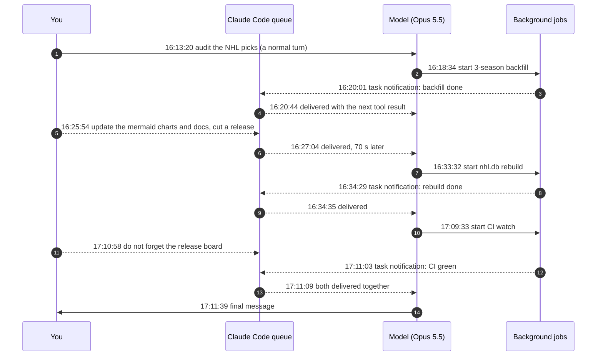
```mermaid
sequenceDiagram
    autonumber
    participant You
    participant Q as Claude Code queue
    participant M as Model (Opus 5.5)
    participant BG as Background jobs
    You->>M: 16:13:20 audit the NHL picks (a normal turn)
    M->>BG: 16:18:34 start 3-season backfill
    BG-->>Q: 16:20:01 task notification: backfill done
    Q-->>M: 16:20:44 delivered with the next tool result
    You-->>Q: 16:25:54 update the mermaid charts and docs, cut a release
    Q-->>M: 16:27:04 delivered, 70 s later
    M->>BG: 16:33:32 start nhl.db rebuild
    BG-->>Q: 16:34:29 task notification: rebuild done
    Q-->>M: 16:34:35 delivered
    M->>BG: 17:09:33 start CI watch
    You-->>Q: 17:10:58 do not forget the release board
    BG-->>Q: 17:11:03 task notification: CI green
    Q-->>M: 17:11:09 both delivered together
    M->>You: 17:11:39 final message
```

Four times (16:19, 16:36, 16:51, 16:59) Claude Code also attached a short *silent-turn reminder*: I had gone a
while without a message to you, and it nudged me to post a one-line update. Those are the short status lines you
saw mid-run.

## The run at a glance


```mermaid
gantt
    title NHL rebuild, 2026-09-30 (Central)
    dateFormat HH:mm:ss
    axisFormat %H:%M
    section Diagnose
    1 Orientation (read tool, analysis, tests, DB)        :p1, 16:13:24, 16:15:43
    2 Settle opening night, find the pattern               :p2, 16:15:53, 16:18:24
    3 Backfill 3 seasons, grade 282 lines, 3 backtests      :p3, 16:18:34, 16:31:48
    section Build
    4 New recipe + blend in nhl_edge.py, first card         :p4, 16:31:59, 16:37:25
    Card to you                                            :milestone, m1, 16:37:57, 16:37:57
    5 Tests 85 to 89, migration, --calibrate rewrite        :p5, 16:37:57, 16:43:39
    6 analysis/06 Python, home ratio, card re-issued        :p6, 16:44:35, 16:53:32
    7 analysis/06 R twin, Py == R, local CI                 :p7, 16:53:40, 16:58:41
    section Ship
    8 README + Mermaid, guide, CLAUDE.md, CHANGELOG         :p8, 16:58:55, 17:08:19
    9 Commits, push, CI, releases                           :p9, 17:08:38, 17:11:39
    First puck (PIT @ PHI, NYI @ TOR)                       :milestone, m2, 18:30:00, 18:30:00
    section Write-up
    First write-up of this document                         :w1, 17:32:01, 17:43:40
    Changelog time fix, push, release re-published          :w2, 17:44:09, 17:46:37
```

The same session as events:

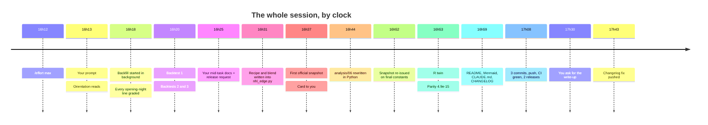
```mermaid
timeline
    title The whole session, by clock
    16h12 : /effort max
    16h13 : Your prompt : Orientation reads
    16h18 : Backfill started in background : Every opening-night line graded
    16h20 : Backtest 1 : Backtests 2 and 3
    16h25 : Your mid-task docs + release request
    16h31 : Recipe and blend written into nhl_edge.py
    16h37 : First official snapshot : Card to you
    16h44 : analysis/06 rewritten in Python
    16h52 : Snapshot re-issued on final constants
    16h53 : R twin : Parity 4.9e-15
    16h59 : README, Mermaid, CLAUDE.md, CHANGELOG
    17h08 : 3 commits, push, CI green, 2 releases
    17h30 : You ask for the write-up
    17h43 : Changelog fix pushed
```

## How one model call is built

*This section is partly general: how Claude Code assembles a request. The sizes are from the transcript.*

A model has no memory between calls. Every one of the 138 calls sent the **whole conversation so far** to the
model, in a fixed order. The order matters, because the prompt cache (next sections) works on identical
*prefixes*: everything that doesn't change sits at the front.

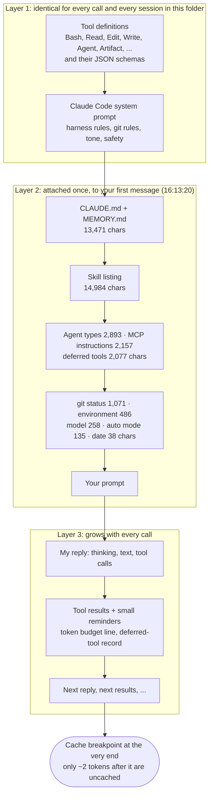
```mermaid
flowchart TB
    subgraph L1["Layer 1: identical for every call and every session in this folder"]
        T["Tool definitions<br/>Bash, Read, Edit, Write, Agent, Artifact, ...<br/>and their JSON schemas"]
        S["Claude Code system prompt<br/>harness rules, git rules, tone, safety"]
    end
    subgraph L2["Layer 2: attached once, to your first message (16:13:20)"]
        A1["CLAUDE.md + MEMORY.md<br/>13,471 chars"]
        A2["Skill listing<br/>14,984 chars"]
        A3["Agent types 2,893 · MCP instructions 2,157<br/>deferred tools 2,077 chars"]
        A4["git status 1,071 · environment 486<br/>model 258 · auto mode 135 · date 38 chars"]
        U["Your prompt"]
    end
    subgraph L3["Layer 3: grows with every call"]
        R1["My reply: thinking, text, tool calls"]
        R2["Tool results + small reminders<br/>token budget line, deferred-tool record"]
        R3["Next reply, next results, ..."]
    end
    T --> S --> A1 --> A2 --> A3 --> A4 --> U --> R1 --> R2 --> R3
    R3 --> BP(["Cache breakpoint at the very end<br/>only ~2 tokens after it are uncached"])
```

What the transcript shows about each layer:

| layer | what's in it | size | how often it changes |
|---|---|---:|---|
| 1 | tool schemas + system prompt | ≈30K tokens (read from cache on call 1) | never within a session |
| 2 | `CLAUDE.md` and memory, skill and agent listings, MCP and deferred-tool notes, git status, environment, date, your prompt | ≈17K tokens (written to cache on call 1) | once |
| 3 | every reply, tool call and tool result since | 0 → 461K tokens | every call |
| tail | the uncached remainder after the breakpoint | 2 tokens a call (276 over 138 calls) | every call |

Layer 3 also picks up two tiny records on nearly every call: the **token budget line** you may have noticed
(`<total_tokens>15000000 tokens left</total_tokens>`, 138 of them) and a **deferred-tools record** (112, about
156 characters each) that tells me which extra tools exist without loading their full schemas. Tools like
`WebFetch` or `CronCreate` stay deferred until asked for, which keeps Layer 1 smaller. None were loaded in this job.

One read hit the size limit: `nhl_edge.py` (1,225 lines) came back truncated with a notice, which is why it took
two `Read` calls.

## The loop: one model call at a time

*General mechanism, with this session's numbers.*

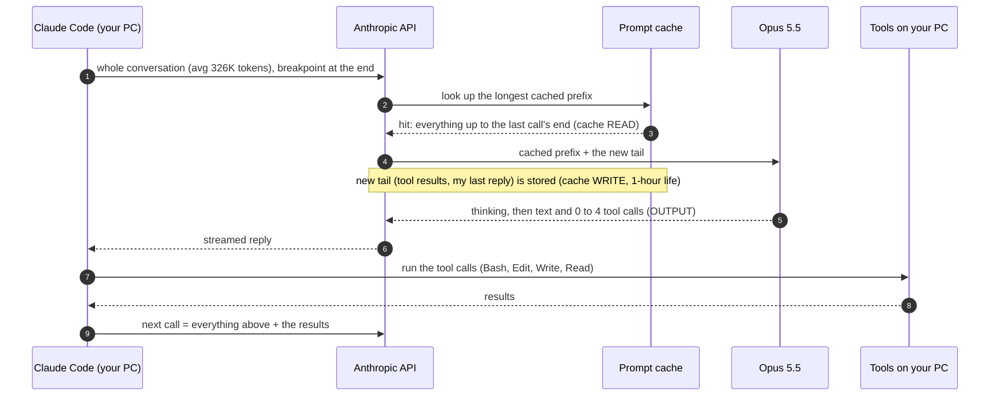
```mermaid
sequenceDiagram
    autonumber
    participant CC as Claude Code (your PC)
    participant API as Anthropic API
    participant C as Prompt cache
    participant O as Opus 5.5
    participant OS as Tools on your PC
    CC->>API: whole conversation (avg 326K tokens), breakpoint at the end
    API->>C: look up the longest cached prefix
    C-->>API: hit: everything up to the last call's end (cache READ)
    API->>O: cached prefix + the new tail
    Note over API,C: new tail (tool results, my last reply) is stored (cache WRITE, 1-hour life)
    O-->>API: thinking, then text and 0 to 4 tool calls (OUTPUT)
    API-->>CC: streamed reply
    CC->>OS: run the tool calls (Bash, Edit, Write, Read)
    OS-->>CC: results
    CC->>API: next call = everything above + the results
```

So every call pays three kinds of token:

- **cache read**: the entire conversation up to the previous call, which the cache already holds;
- **cache write**: what's new since then, the previous reply and the tool results that came back;
- **output**: what I generate now.

Because the read is the *whole* conversation every time, total reads grow roughly with the square of the number of
calls. 138 calls averaging 322K tokens of context is 44.5M tokens read, though the conversation itself never
passed 508K.

## Token routing: where every token came from and went

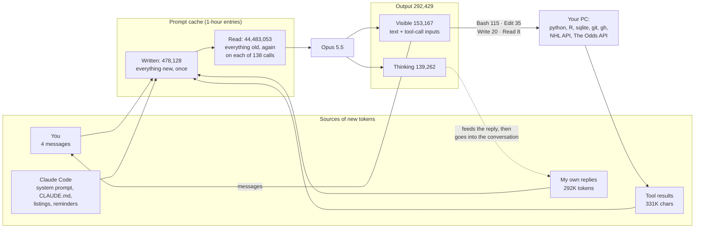
```mermaid
flowchart LR
    subgraph IN["Sources of new tokens"]
        Y["You<br/>4 messages"]
        H["Claude Code<br/>system prompt, CLAUDE.md,<br/>listings, reminders"]
        TR["Tool results<br/>331K chars"]
        ME["My own replies<br/>292K tokens"]
    end
    subgraph CACHE["Prompt cache (1-hour entries)"]
        W["Written: 478,128<br/>everything new, once"]
        RD["Read: 44,483,053<br/>everything old, again<br/>on each of 138 calls"]
    end
    subgraph OUT["Output 292,429"]
        TH["Thinking 139,262"]
        VIS["Visible 153,167<br/>text + tool-call inputs"]
    end
    Y --> W
    H --> W
    TR --> W
    ME --> W
    W --> RD
    RD --> O["Opus 5.5"]
    O --> TH
    O --> VIS
    VIS -->|"Bash 115 · Edit 35<br/>Write 20 · Read 8"| TOOLS["Your PC:<br/>python, R, sqlite, git, gh,<br/>NHL API, The Odds API"]
    TOOLS --> TR
    VIS -->|"messages"| Y
    TH -.->|"feeds the reply, then<br/>goes into the conversation"| ME
```

Tool results, in characters (the transcript stores text, not tokens; on code and tables a token is very roughly
3–4 characters, so treat any token conversion as an estimate):

| tool | calls | result chars | what came back | chars I sent in (tool inputs) |
|---|---:|---:|---|---:|
| Bash | 115 | 228,842 | script summaries, grep hits, `sed -n` windows, test and CI output | 86,655 |
| Read | 8 | 94,652 | whole files: `nhl_edge.py` twice, the analysis loop, loader, tests | 763 |
| Write | 20 | 4,185 | "file written" | 152,339 |
| Edit | 35 | 3,810 | "file edited" | 56,909 |
| **total** | **178** | **331,489** | | **296,666** |

The last column is output, not input: the files I wrote (`nhl_loop.py`, `nhl_loop.R`, the scratch backtests) and
the edits I made are text I generated, then passed to a tool. Write and Edit results are tiny; Read results are
the heavy ones, which is why there were only eight.

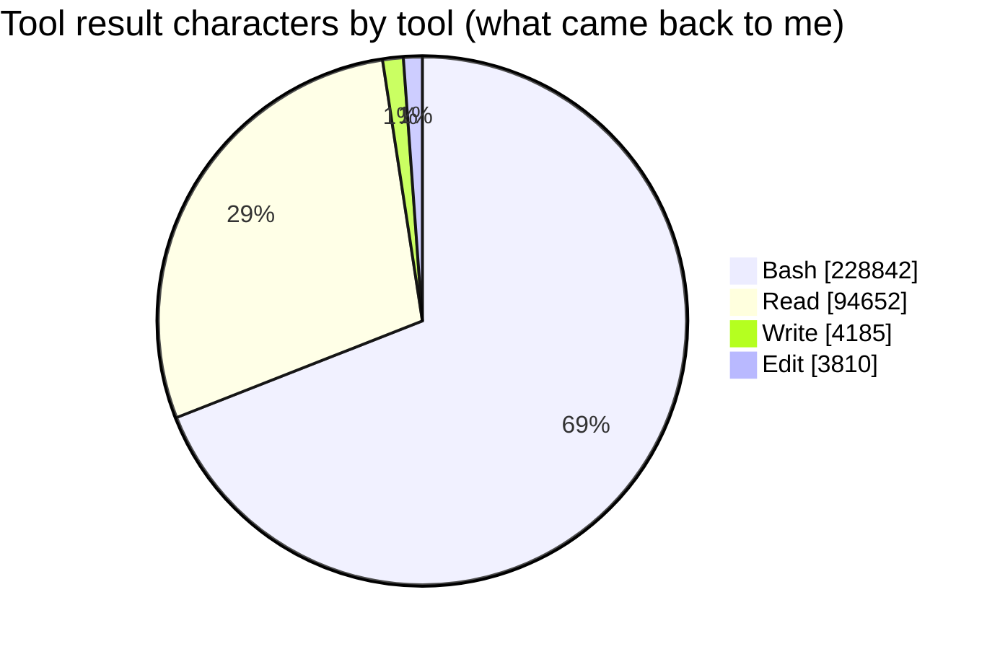
```mermaid
pie showData
    title Tool result characters by tool (what came back to me)
    "Bash" : 228842
    "Read" : 94652
    "Write" : 4185
    "Edit" : 3810
```

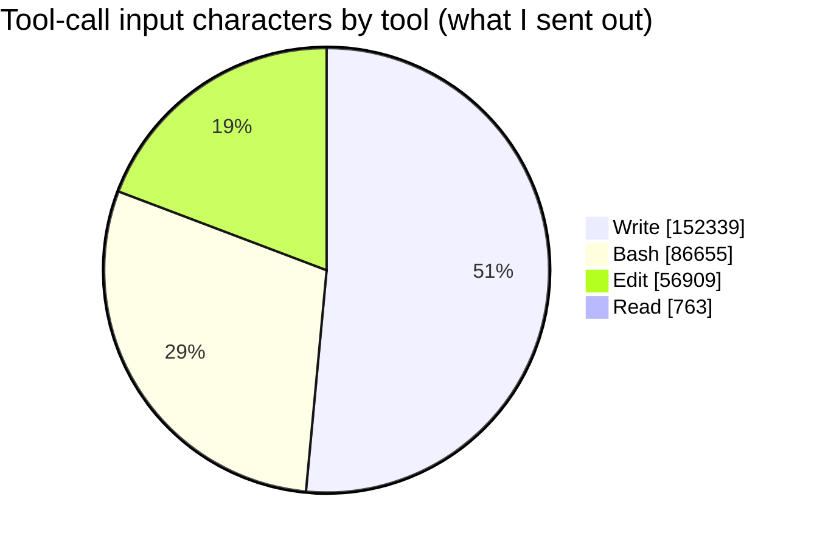
```mermaid
pie showData
    title Tool-call input characters by tool (what I sent out)
    "Write" : 152339
    "Bash" : 86655
    "Edit" : 56909
    "Read" : 763
```

The twelve largest results:

| chars | tool | what |
|---:|---|---|
| 51,598 | Read | `nhl_edge.py`, first part (hit the read limit) |
| 16,787 | Bash | the README's NHL section |
| 14,589 | Read | `tests/test_nhl_edge.py` |
| 13,456 | Bash | the R twin of the NHL analysis loop |
| 12,870 | Read | `analysis/06_nhl/nhl_loop.py` (the old one) |
| 12,076 | Read | `nhl_edge.py`, the rest |
| 8,593 | Bash | README architecture and analysis diagrams |
| 8,470 | Bash | the top of opening night's report |
| 7,770 | Bash | set pooled home ratios and `TEAM_RHO`, rerun checks (an error; see mistakes) |
| 6,710 | Bash | the analysis README's NHL section |
| 6,571 | Bash | grep for stale NHL references across the docs |
| 6,215 | Bash | README and guide headings, recent changelog |

Almost everything big is orientation: reading what already existed. The 102,901 backfilled game rows, the 282
graded lines and the backtests never came back as rows, only as summaries of a few dozen lines.

## Token accounting

### Totals for the job (16:13 → 17:11)

| | tokens | what it is |
|---|---:|---|
| Cache reads | **44,483,053** | the conversation so far, re-sent on every call and served from the prompt cache |
| Cache writes | **478,128** | new material added to the conversation (tool results, file contents, my messages); all with a 1-hour lifetime |
| Output | **292,429** | everything I generated: code, docs, commands, messages |
| └ of which thinking | 139,262 | reasoning before acting (48% of output) |
| Uncached input | **276** | the 2 tokens after the last cache breakpoint on each call |
| **Total processed** | **45,253,886** | cache reads are **98.9%** of all input |
| Peak conversation size | 508,445 | the context on the last call (started around 47K with the system prompt) |
| Model calls | 138 | all `claude-opus-5-5`; no subagent sidechains |
| Tool calls | 178 | Bash 115 · Edit 35 · Write 20 · Read 8 (parallel calls share one model call) |

Averaged out, each of the 138 calls re-read about 322K tokens of conversation. That average is why the
total is 45 million, even though the conversation itself only ever reached about half a million.

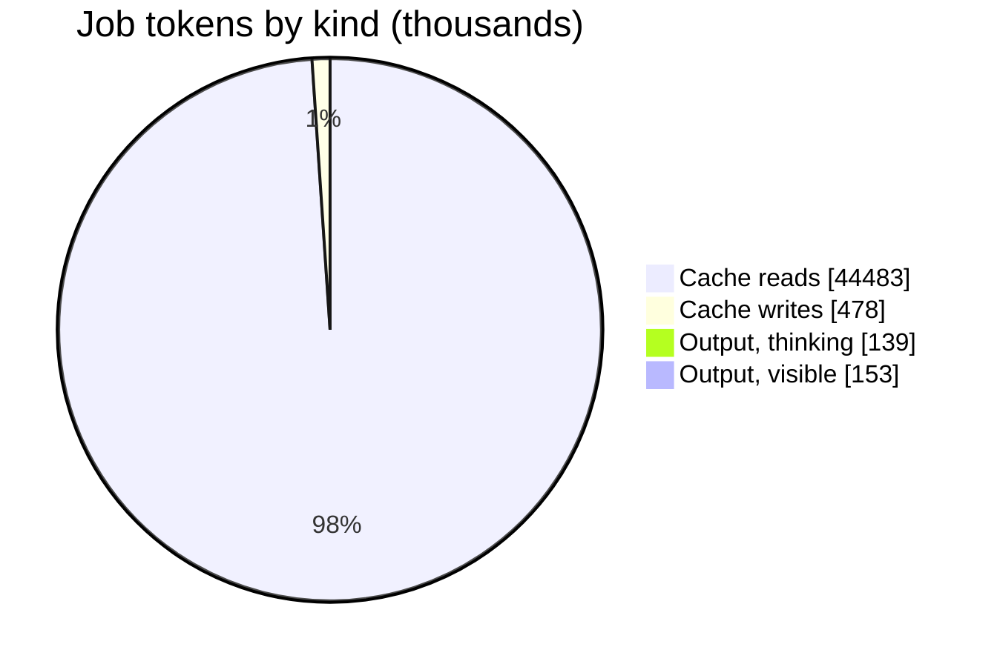
```mermaid
pie showData
    title Job tokens by kind (thousands)
    "Cache reads" : 44483
    "Cache writes" : 478
    "Output, thinking" : 139
    "Output, visible" : 153
```

Cache reads swamp the chart, so here is only the *new* work, the 770K tokens that weren't a re-read:

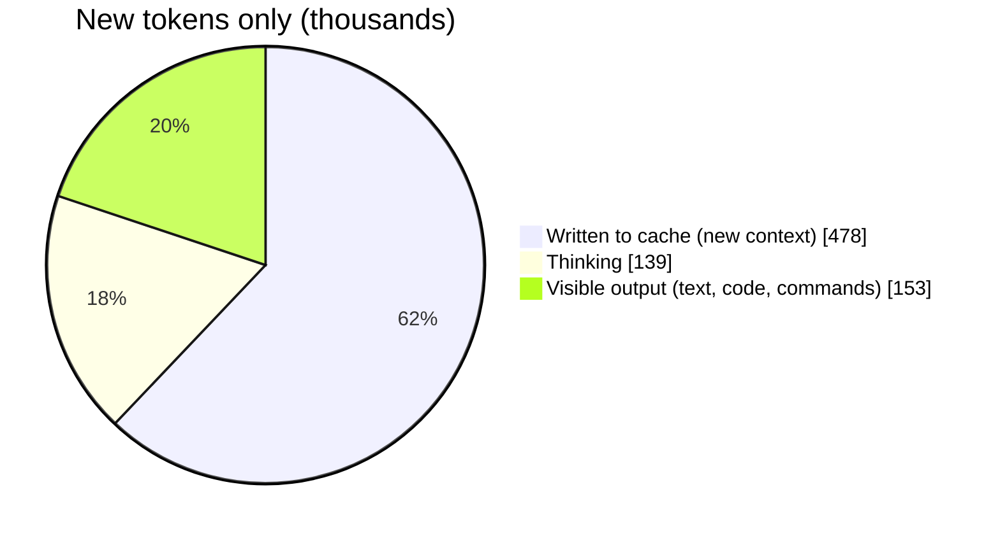
```mermaid
pie showData
    title New tokens only (thousands)
    "Written to cache (new context)" : 478
    "Thinking" : 139
    "Visible output (text, code, commands)" : 153
```

### By phase

| phase | time | calls | tools | processed | share | avg context / call | output (thinking) |
|---|---|---:|---:|---:|---:|---:|---:|
| 1 Orientation | 16:13–16:15 (2m 19s) | 11 | 14 | 1,074,587 | 2.4% | 96,563 | 12,391 (9,853) |
| 2 Settle + diagnose | 16:15–16:18 (2m 31s) | 3 | 3 | 428,605 | 0.9% | 138,088 | 14,341 (12,522) |
| 3 Data + backtests | 16:18–16:31 (13m 14s) | 10 | 14 | 1,691,722 | 3.7% | 164,689 | 44,835 (26,463) |
| 4 Implement + first card | 16:31–16:37 (5m 26s) | 23 | 35 | 5,271,725 | 11.6% | 227,801 | 32,303 (11,571) |
| 5 Tests + `--calibrate` | 16:37–16:43 (5m 42s) | 13 | 17 | 3,624,490 | 8.0% | 275,901 | 37,775 (18,993) |
| 6 analysis/06 Python | 16:44–16:53 (8m 57s) | 22 | 24 | 7,600,280 | 16.8% | 342,749 | 59,812 (32,718) |
| 7 R twin + parity | 16:53–16:58 (5m 01s) | 10 | 13 | 3,973,141 | 8.8% | 394,323 | 29,908 (6,516) |
| 8 Docs + Mermaid | 16:58–17:08 (9m 24s) | 32 | 42 | 14,549,903 | 32.2% | 453,135 | 49,576 (15,412) |
| 9 Ship | 17:08–17:11 (3m 01s) | 14 | 16 | 7,039,433 | 15.6% | 501,996 | 11,488 (5,214) |
| **Job total** | **58m 15s** | **138** | **178** | **45,253,886** | 100% | 325,808 | 292,429 (139,262) |

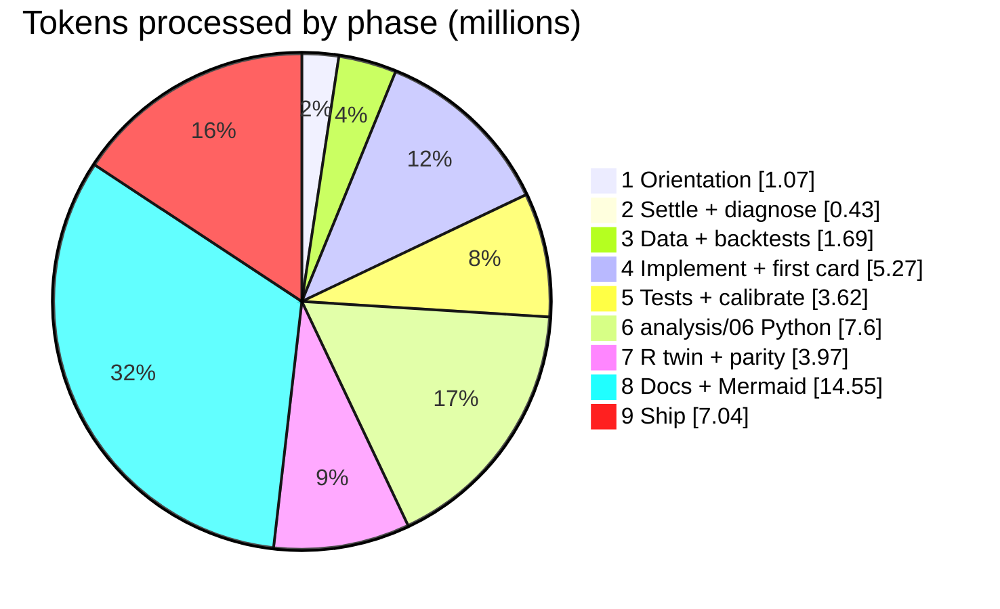
```mermaid
pie showData
    title Tokens processed by phase (millions)
    "1 Orientation" : 1.07
    "2 Settle + diagnose" : 0.43
    "3 Data + backtests" : 1.69
    "4 Implement + first card" : 5.27
    "5 Tests + calibrate" : 3.62
    "6 analysis/06 Python" : 7.60
    "7 R twin + parity" : 3.97
    "8 Docs + Mermaid" : 14.55
    "9 Ship" : 7.04
```

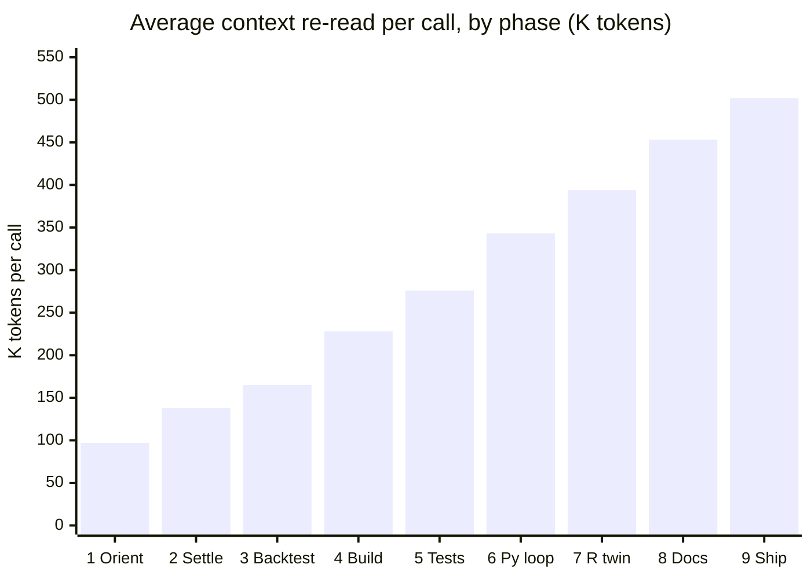
```mermaid
xychart-beta
    title "Average context re-read per call, by phase (K tokens)"
    x-axis ["1 Orient", "2 Settle", "3 Backtest", "4 Build", "5 Tests", "6 Py loop", "7 R twin", "8 Docs", "9 Ship"]
    y-axis "K tokens per call" 0 --> 550
    bar [97, 138, 165, 228, 276, 343, 394, 453, 502]
```

**The science was cheap; the paperwork was not.** Phase 3 found the real problem and proved the fix. It covered
the three-season backfill, grading every opening-night line against the market, and all three backtests, yet
it used **3.7%** of the tokens. The docs and shipping at the end used **48%**. That isn't because they were
harder. By then every call re-read 450–500K tokens of conversation, while phase 3's calls re-read about 165K.
In a long session, the late phases pay rent on everything that came before.

### How the conversation grew

Context on every sixth call, across the whole session (job, then the first write-up and the changelog fix):

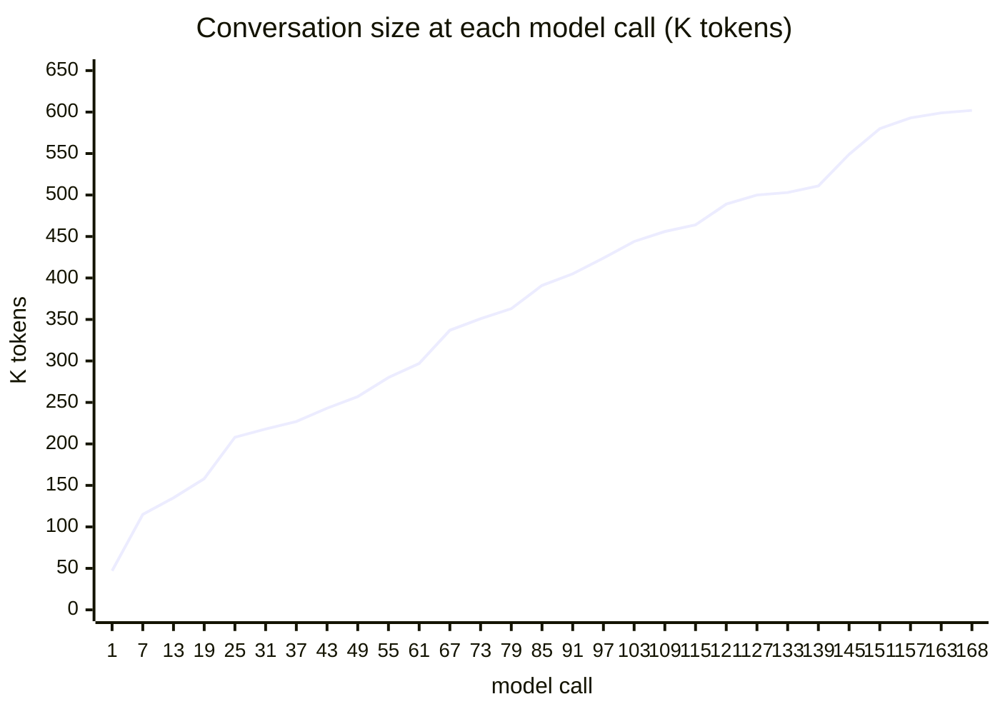
```mermaid
xychart-beta
    title "Conversation size at each model call (K tokens)"
    x-axis "model call" ["1", "7", "13", "19", "25", "31", "37", "43", "49", "55", "61", "67", "73", "79", "85", "91", "97", "103", "109", "115", "121", "127", "133", "139", "145", "151", "157", "163", "168"]
    y-axis "K tokens" 0 --> 650
    line [47, 115, 135, 158, 208, 218, 227, 243, 257, 280, 297, 337, 351, 363, 391, 405, 424, 444, 456, 464, 489, 500, 503, 511, 549, 580, 593, 599, 602]
```

The steepest climbs are the orientation reads (calls 1–7, +68K: whole files), the recipe build (19–25, +50K) and
the Python analysis rewrite (61–67, +40K: writing `nhl_loop.py` puts the whole file into the conversation). Calls
133–139 are flat: that's the 20-minute pause after the job, when nothing was added.

### How to read these numbers

- **Cache reads** are not new work. Each model call sends the whole conversation back to the model, and the
  prompt cache serves the part it has already seen. 98.9% of input tokens came from the cache.
- **Cache writes** are what was new to the conversation on each call: a tool result, a file I read, the
  message I'd just written.
- **Output** is everything I generated, thinking included. At max effort, about half of it (48%) was
  thinking before acting.
- **The counter I could see.** Claude Code also showed me a running budget: 15,000,000 at the start, and
  14,492,875 when the releases were verified. That 507K is the size the conversation grew to, and it matches
  the transcript's peak context of 508,445. It showed 15,000,000 again when you sent this request, so it's a
  per-request working budget, not your plan meter.

## The prompt cache, explained

*The mechanism is general; every number is from this session.*

**What it is.** The API can keep the processed form of a prompt's prefix for a while. When the next request starts
with exactly the same tokens, the model doesn't reprocess them: they're a *cache read*, which is much faster and
billed at a small fraction of fresh input. Anything after the matching prefix is processed normally and stored for
next time: a *cache write*, billed at a premium over fresh input. A cache entry is only reusable by a request whose
prefix matches it token for token, which is why Claude Code keeps the unchanging parts (tools, system prompt,
`CLAUDE.md`) at the front and only ever appends.

**Where the breakpoint sits.** Claude Code marks a cache breakpoint at the end of each request. Everything up to it
is either read (already cached) or written (new). Only what falls after it is plain input, and here that was 2
tokens a call: 276 across the job.

**Lifetime.** Cache entries have a time-to-live that refreshes each time they're read. The transcript records
which lifetime each write used, and **all 478,128 written tokens used the 1-hour one, and none the 5-minute one**.

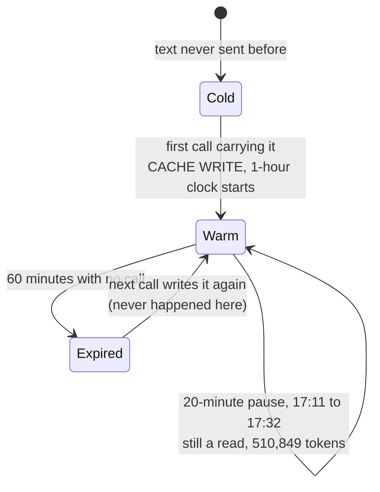
```mermaid
stateDiagram-v2
    [*] --> Cold: text never sent before
    Cold --> Warm: first call carrying it<br/>CACHE WRITE, 1-hour clock starts
    Warm --> Warm: every later call<br/>CACHE READ, clock resets
    Warm --> Warm: 20-minute pause, 17:11 to 17:32<br/>still a read, 510,849 tokens
    Warm --> Expired: 60 minutes with no call
    Expired --> Warm: next call writes it again<br/>(never happened here)
```

What that bought in this session:

- **Call 1 already hit the cache.** Its first 30,315 tokens (Layer 1: tools and system prompt) were a read, not a
  write. That prefix is the same for any Claude Code session in this folder with the same tools, so it was most
  likely still warm from an earlier request. Only 16,664 tokens (Layer 2 and your prompt) were written.
- **No misses.** A miss would show as the read count dropping between two consecutive calls. It rose on every one of
  168 calls.
- **The pause didn't cost anything.** From 17:11:46 to 17:32:01 nothing happened. With a 5-minute lifetime the whole
  510K-token conversation would have had to be written again; with the 1-hour one, the first write-up call read
  510,849 tokens from cache and wrote 91.
- **A call's write is roughly what came back since the last call.** Call 3 wrote 22,839 tokens: the first
  `nhl_edge.py` read. Call 110 wrote 454: a short grep. Across the job, writes averaged 3,465 tokens a call.

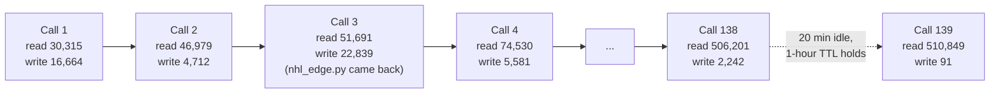
```mermaid
flowchart LR
    C1["Call 1<br/>read 30,315<br/>write 16,664"] --> C2["Call 2<br/>read 46,979<br/>write 4,712"]
    C2 --> C3["Call 3<br/>read 51,691<br/>write 22,839<br/>(nhl_edge.py came back)"]
    C3 --> C4["Call 4<br/>read 74,530<br/>write 5,581"]
    C4 --> D["..."]
    D --> C138["Call 138<br/>read 506,201<br/>write 2,242"]
    C138 -.->|"20 min idle,<br/>1-hour TTL holds"| C139["Call 139<br/>read 510,849<br/>write 91"]
```

Read each call as *read(n) = read(n−1) + write(n−1)*: last call's new material becomes this call's cached prefix.
Call 2 read 46,979 = 30,315 + 16,664, exactly.

## Parallel tool calls

**What they are.** One model reply can contain several tool calls. Claude Code runs them and hands all the
results back together, so a single model call does the work of several. I choose to do it when the calls don't
depend on each other: three files to read, an edit plus the test run that checks it, a scratch script plus the
command that runs it. When the second call needs the first one's output, they have to be sequential.

**Where they came from here.** 137 of the 138 calls used tools (the last one was the final message to you):

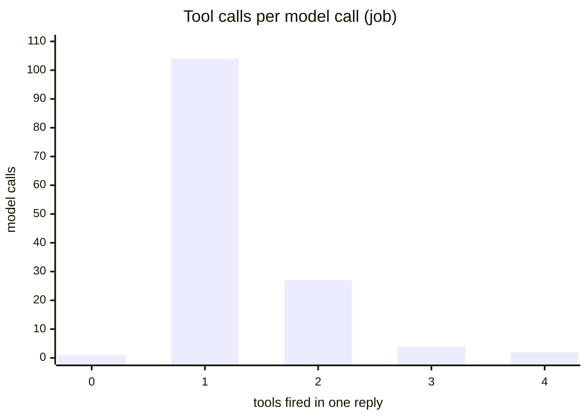
```mermaid
xychart-beta
    title "Tool calls per model call (job)"
    x-axis "tools fired in one reply" ["0", "1", "2", "3", "4"]
    y-axis "model calls" 0 --> 110
    bar [1, 104, 27, 4, 2]
```

| combination | times | typical use |
|---|---:|---|
| Bash + Write | 10 | write a scratch script, run it in the same reply |
| Bash + Edit | 9 | edit the code, then lint/test it |
| Edit + Edit | 6 | two independent edits to one file |
| Bash + Bash | 2 | two independent looks (repo listing + report listing) |
| Bash + Edit + Edit | 2 | two edits and the check |
| Read + Read + Read | 1 | the analysis loop, the loader and the tests at 16:14:41 |
| Edit + Edit + Edit | 1 | three recipe edits to `nhl_edge.py` at 16:33:58 |
| Bash + Edit + Edit + Edit | 1 | three R fixes and the re-run of both twins at 16:57:12 |
| Write × 4 | 1 | the license patch script and the three commit messages, at 17:08:52 |

Two of them, drawn out:

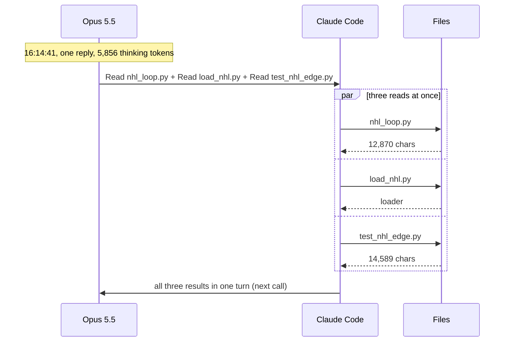
```mermaid
sequenceDiagram
    participant M as Opus 5.5
    participant CC as Claude Code
    participant FS as Files
    Note over M: 16:14:41, one reply, 5,856 thinking tokens
    M->>CC: Read nhl_loop.py + Read load_nhl.py + Read test_nhl_edge.py
    par three reads at once
        CC->>FS: nhl_loop.py
        FS-->>CC: 12,870 chars
    and
        CC->>FS: load_nhl.py
        FS-->>CC: loader
    and
        CC->>FS: test_nhl_edge.py
        FS-->>CC: 14,589 chars
    end
    CC->>M: all three results in one turn (next call)
```

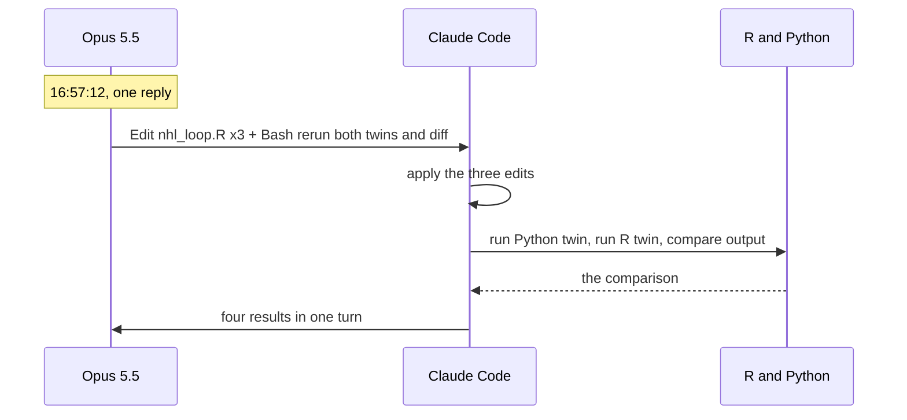
```mermaid
sequenceDiagram
    participant M as Opus 5.5
    participant CC as Claude Code
    participant R as R and Python
    Note over M: 16:57:12, one reply
    M->>CC: Edit nhl_loop.R x3 + Bash rerun both twins and diff
    CC->>CC: apply the three edits
    CC->>R: run Python twin, run R twin, compare output
    R-->>CC: the comparison
    CC->>M: four results in one turn
```

The edits run before the check because they come first in the reply; that ordering is what lets an edit and its
test share one model call.

**What it saved.** 33 replies carried 74 tool calls. Done one at a time, those would have taken 41 extra model
calls, and each extra call would have re-read the whole conversation at that point. Summing the context at each of
those calls gives **about 12.3M tokens of re-reading avoided**. That's a lower bound: separate calls would each also
have added a little more context.

## The tools: what ran, how long, what came back

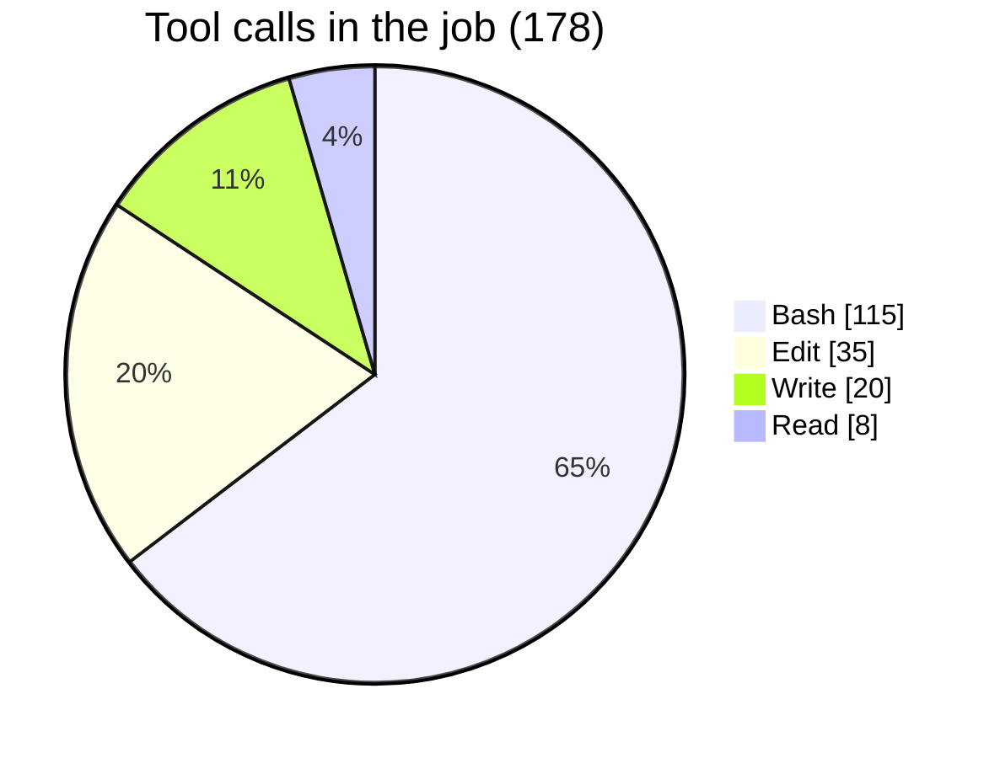
```mermaid
pie showData
    title Tool calls in the job (178)
    "Bash" : 115
    "Edit" : 35
    "Write" : 20
    "Read" : 8
```

Tool mix by phase (phases assigned by each model call's start time, so a call or two near a boundary lands one
phase over from the table above):

| phase | Bash | Edit | Write | Read | replies with 2+ tools |
|---|---:|---:|---:|---:|---:|
| 1 Orientation | 10 | | | 5 | 3 |
| 2 Settle + diagnose | 3 | | | | 0 |
| 3 Data + backtests | 9 | 2 | 4 | | 5 |
| 4 Implement + first card | 15 | 18 | | | 9 |
| 5 Tests + `--calibrate` | 10 | 6 | 1 | | 3 |
| 6 analysis/06 Python | 19 | 3 | 2 | 1 | 2 |
| 7 R twin + parity | 8 | 3 | 2 | | 1 |
| 8 Docs + Mermaid | 31 | 3 | 7 | | 9 |
| 9 Ship | 10 | | 4 | 2 | 1 |

Bash did the heavy lifting: every Python and R run, every SQL check, `git`, `gh`, `ruff`, `pytest`, the Mermaid
parser, and targeted `sed -n` / `grep` looks at files instead of whole-file reads.

### Where the time went

Claude Code's own counter for the whole session (job and write-ups) says the model was working for **58.9
minutes** of API time and tools for **12.2 minutes**. Most of the wall clock was me thinking and writing, not
waiting on scripts. The longest waits:

| seconds | tool | what |
|---:|---|---|
| 156 | Bash | backtest 1, the walk-forward projection backtest |
| 130 | Bash | backtest 2, with opponent and home factors |
| 90 | Bash | backtest 3, the fair comparison on a fixed player set |
| 45 | Bash | parse every Mermaid block in both READMEs |
| 43 | Bash | block until CI finishes |
| 39 | Bash | block until CI on the write-up commit finishes (write-up) |
| 19 | Bash | the full CI sequence locally against empty DBs |
| 18 | Bash | Python then R analysis twins |

Three jobs ran in the **background**, so work continued while they did:


```mermaid
gantt
    title Background jobs vs foreground work
    dateFormat HH:mm:ss
    axisFormat %H:%M
    section Background
    Backfill 3 seasons, 2,160 player-seasons   :b1, 16:18:34, 16:20:01
    Rebuild nhl.db, 2,053 player-seasons      :b2, 16:33:32, 16:34:29
    CI watch                                  :b3, 17:09:33, 17:11:03
    section Foreground meanwhile
    Odds math, grade 282 lines, write backtest 1   :f1, 16:18:50, 16:20:41
    8 edits to nhl_edge.py, lock rendering         :f2, 16:33:53, 16:34:34
    Release bodies, CI job statuses                :f3, 17:09:46, 17:10:12
```

### Errors

Six of 178 tool calls in the job returned an error, and three more in the write-up. Each was caught on the spot
(the exact error text is in the transcript):

| when | what | error | what I did |
|---|---|---|---|
| 16:19 | check backfill progress | the harness blocked `sleep 45` | waited on the job's own notification instead |
| 16:46 | check every game has both teams' skater logs | `sqlite3.OperationalError: ambiguous column name: team` | qualified the column |
| 16:49 | set pooled home ratios and `TEAM_RHO`; rerun checks | ruff: 14 errors, from the heredoc `\\` → `\` newline in an f-string | rewrote the patch as a file with raw strings |
| 16:51 | re-score opening-night edges by band | `KeyError: 'assists'` in my scratch script | fixed the key and re-ran |
| 16:56 | compare Python vs R cell by cell | the printed tables differed: `NaN` vs `nan`, `ρ` padded by bytes | the three cosmetic fixes in step 7 |
| 16:59 | update top-level README diagrams and test counts | the script's `assert` found no match: its target text had a `·` that arrived mangled | re-did it matching on ASCII (the glyph gotcha in `CLAUDE.md`) |
| 17:33 | per-phase token totals (write-up) | `can't compare offset-naive and offset-aware datetimes` | stripped the timezone |
| 17:45 | republish the rules release (fix) | `gh`: `Unknown JSON field: "isLatest"` | the edit itself had gone through; re-verified the body with valid fields and `gh release list` |
| 17:45 | wait for CI on the fix commit | the run lookup came back empty, so `gh run view` hit HTTP 404 | listed recent runs and watched run 36787342574 |

## Effort level

**Max, for every call.** At 16:12:35, before the prompt, you ran `/effort` and Claude Code answered *"Set effort
level to max (this session only): Maximum capability with deepest reasoning."* Every one of the 499 assistant
entries in the transcript (the 168 model calls, logged once per content block) records `effort: max` and
`perTurnEffort: max`. It never changed mid-session.

*What effort does, in general:* it's a setting sent with each request that tells the model how much to reason
and how thorough to be before it acts. Higher effort means more thinking tokens, more checking, and usually
longer, more careful replies; lower effort means quicker, shorter turns. It doesn't change the model (Opus 5.5
either way), the tools, or the prompt cache.

What max looked like here:

- **Thinking was 48% of output** (139,262 of 292,429 tokens in the job).
- **It came in bursts before decisions** (next section), not evenly: 14 of the 138 calls did more than 3,000
  thinking tokens, while 24 routine calls (a grep, a test run) did none at all.
- **It's small next to the reads.** Even at max, all output together was 0.6% of tokens processed. Effort
  mostly changes the *output* bill; the size of the conversation drives the read bill.

```mermaid
flowchart LR
    E["/effort max<br/>16:12:35, this session only"] --> REQ["every request<br/>effort = max"]
    REQ --> TH["more thinking before acting<br/>139K tokens, 48% of output"]
    REQ --> CH["more checking<br/>backtest 3, parity to 1e-15,<br/>recomputed claims"]
    TH --> OUT["output 292K"]
    OUT --> SMALL["0.6% of the 45.3M processed"]
```

The session that wrote *this edition* ran at the default **medium** effort (its transcript says so on every
call), which is one reason its thinking share is lower; see the last section.

## Thinking

At max effort, 48% of output was thinking. It came in bursts, right before the decisions that mattered:

| time | thinking tokens | what came next |
|---|---:|---|
| 16:31:48 | 12,752 | the recipe and blend edits to `nhl_edge.py` (also the largest reply in the job, 14,103 tokens) |
| 16:17:54 | 9,990 | after the settle: reading the pattern, then checking tonight's schedule |
| 16:46:01 | 8,939 | planning the `analysis/06` rewrite before checking the data |
| 16:39:16 | 7,104 | rewriting the tests the new recipe broke |
| 16:14:41 | 5,856 | after the first reads: deciding what to look at next |
| 16:24:22 | 5,329 | backtest 2's design |

```mermaid
xychart-beta
    title "Output by phase: thinking (bars) and total output (line), K tokens"
    x-axis ["1 Orient", "2 Settle", "3 Backtest", "4 Build", "5 Tests", "6 Py loop", "7 R twin", "8 Docs", "9 Ship"]
    y-axis "K tokens" 0 --> 65
    bar [9.9, 12.5, 26.5, 11.6, 19.0, 32.7, 6.5, 15.4, 5.2]
    line [12.4, 14.3, 44.8, 32.3, 37.8, 59.8, 29.9, 49.6, 11.5]
```

Phase 2 was almost all thinking (87%: reading the settle results) and phase 3 mostly (59%: designing the
backtests). Phase 7 was almost all writing (the R
twin was a translation of a design already settled in Python).

## Models and routing: what ran and what didn't

```mermaid
flowchart TB
    You["You, in the terminal"] --> CC["Claude Code 2.1.285<br/>auto permission mode"]
    CC -->|"168 calls, max effort"| OP["claude-opus-5-5<br/>the whole job"]
    CC -->|"1 small call:<br/>956 in, 12 out"| HK["claude-haiku-4-5<br/>likely the session title"]
    CC -. "not used" .-> SA["Subagents / sidechains: 0"]
    CC -. "not used" .-> WEB["Web search and fetch: 0"]
    OP --> TOOLS["Bash · Edit · Write · Read"]
    TOOLS --> PC["Your PC: python, R, sqlite3,<br/>ruff, pytest, node, git"]
    TOOLS --> NET["Network, from scripts:<br/>NHL public API, The Odds API,<br/>ESPN, GitHub via gh"]
```

- **Every model call was Opus 5.5**, main thread, no sidechains. No subagents means nothing was read twice in two
  separate contexts, which on this task would have cost more than it saved: the job was one tightly connected
  chain (diagnose → fit → build → document), not independent pieces.
- **One Haiku call** of 956 input tokens and 12 output tokens appears in Claude Code's counter. The transcript
  doesn't label it; the session's title ("NHL picks accuracy audit") was generated around then, so that's the
  likely use.
- **Auto mode.** You ran in auto permission mode, so tool calls ran without prompting you. Each reply carries a
  permission-classifier request id; that check runs on Anthropic's side and its tokens don't appear in these
  counts.
- **Network** went out only from the scripts I ran (the NHL API for game logs and rosters, The Odds API for
  tonight's lines, pulled once and cached to CSV, and `gh` for GitHub), never from a web tool.

## Claude Code's own counter and the dollar figure

Claude Code keeps a running cost-state for the session (job **plus** the first write-up and the changelog fix):

| | Claude Code counter | sum of transcript calls | difference |
|---|---:|---:|---:|
| Opus cache reads | 63,821,141 | 61,610,869 | 2,210,272 |
| Opus cache writes | 571,784 | 567,722 | 4,062 |
| Opus output | 361,292 | 360,398 | 894 |
| └ thinking | 181,159 | 180,396 | 763 |
| Opus uncached input | 1,950 | 336 | 1,614 |
| Haiku | 956 in / 12 out | not in transcript | |
| API time / tool time | 58.9 min / 12.2 min | | |
| Lines added / removed | 3,101 / 321 | | |

The counter is about 2.2M reads higher than the transcript. That's the size of four calls over the ~550K
conversation. Claude Code makes some calls that aren't logged as assistant messages, such as the "while you were
away" recap it generated at 17:14:54; I can't itemize them.

The counter also prices the session at **$24.57** at API list prices. **That is not what you pay.** You're on a plan
with a usage meter, not per-token billing; the figure is only a sense of scale. Almost all of it comes from the
63.8M cache reads and the output, not from the 1,950 uncached input tokens.

### About the 10%

That number comes from your plan's usage meter. I can't see that meter from inside a session, so the 10%
is your reading, not something I measured. I also don't know exactly how your plan weighs cache reads
against fresh input and output, so I won't convert 45.3M tokens into a percentage of anything.

What the transcript can say is that most of the 45.3M were cache reads, which on the API cost a small fraction
of fresh input. The genuinely new tokens were about 770K: 478K written to the cache and 292K generated. Whatever
formula your meter uses, the work was mostly re-reading a cached conversation, not generating.

### What kept it lean

- **The data never went through the model.** The backfill (102,901 game rows), the three backtests, and the
  analysis loop ran as scripts. I read their summaries, usually a few dozen lines, never the rows.
- **Targeted reads.** There were only 8 whole-file `Read` calls. Most looks at code and docs were
  `sed -n` / `grep` windows onto the exact lines needed.
- **Background jobs.** The history backfill (2,160 player-seasons), the `--build` rebuild (2,053) and the CI
  watch ran while work continued.
- **Parallel tool calls.** 178 tool calls fit into 138 model calls, about 12.3M re-read tokens avoided.
- **No subagents,** so nothing was read twice in separate contexts.
- **The 1-hour cache.** No misses, even across the 20-minute pause.
- **Reuse.** The Mermaid checker (mermaid 11.17 + jsdom) from an earlier session was run in place rather
  than reinstalled.
- **No summarization.** The conversation stayed under its limit the whole time, so nothing had to be
  re-derived after a summary.

### What would have made it leaner

- **Docs last cost the most.** Phase 8 re-read 453K a call. Mapping the stale doc references early, while the
  context was 150K, would have cut that phase's cost roughly in half, at the price of a second pass if the numbers
  moved (and they did: the home factor changed in phase 6).
- **More batching in phases 6 and 8.** Phase 6 had 22 calls and only 2 parallel ones; several of its Bash checks
  were independent.
- **One fewer whole-file read.** `nhl_edge.py` came back in two reads totalling 63.7K characters; a `grep`-first
  pass would have needed perhaps a third of it.

## How it was done, step by step

```mermaid
flowchart TD
    A["Your prompt 16:13"] --> B["1 Read tool, analysis, tests, DB"]
    B --> C{"Red flags"}
    C -->|"47+ STRONG overs at +18-29%"| D["2 Settle opening night"]
    C -->|"--calibrate tests a different recipe"| D
    D --> E["Overs cashed 33.7% vs 54.3% expected"]
    E --> F["3 Backfill 3 seasons, no survivorship"]
    F --> G["Grade all 282 lines: market 0.6476 vs model 0.6667"]
    G --> H["Backtests 1, 2, 3"]
    H --> I["Winner: per-minute rate regressed<br/>to the position mean x minutes"]
    I --> J["4 Build into nhl_edge.py + blend"]
    J --> K["First card 16:37"]
    K --> L["5 Tests 85 to 89, MODEL_VERSION, --calibrate"]
    L --> M["6 analysis/06 in Python"]
    M --> N{"Ablation: home factor worthless<br/>out of sample"}
    N --> O["Pooled home ratio, TEAM_RHO re-measured<br/>card re-issued 16:52"]
    O --> P["7 R twin, parity 4.9e-15, local CI"]
    P --> Q["8 README, Mermaid 28/28, guide,<br/>CLAUDE.md, CHANGELOG, LICENSE"]
    Q --> R["9 3 commits, push, CI green, 2 releases"]
```

### 1. Orientation (16:13–16:15)

- **Read the code.** Read `nhl_edge.py` (1,225 lines) in two reads, last night's report,
  `analysis/06_nhl` in both runtimes, the loader, the tests, CI, requirements and the lint config.
- **Checked `nhl.db` with SQL:**
  - only one season of game logs (2025-26, 47,096 rows);
  - no blocked shots anywhere;
  - 187 unsettled paper bets and 577 prop rows from opening night.
- **The first red flag was in last night's report:** 47+ "STRONG PROP" rows, almost all overs, at +18–29%.
  When a model disagrees with the market by that much, in the same direction, dozens of times, the model
  is usually the one that's wrong.
- **The second:** `--calibrate` tested a *different* recipe than the live one (shrink toward the league average,
  no prior season). The live model had never been tested the way it actually runs.
- **Backed up `nhl.db`** to the scratchpad before touching anything.

### 2. Settle opening night and find the pattern (16:15–16:18)

- **`--settle`:** 187 props, $347 staked, −$117.33.
- **The lock + five went 3 of 6.** Suzuki o0.5 PTS, Lindholm u0.5 A and Pastrnak o0.5 PTS lost; Walman u0.5 A,
  McDavid o0.5 A (2 assists) and Eichel o0.5 PTS (3 points) won.
- **Overs were the problem, not the lock.** Value-board overs cashed 33.7% against a model average of 54.3%;
  agree-board overs cashed 43.6% against 62.5%.
- **Last night's scores:** 3 of 5 games were low-event (FLA 1–0 CAR on 35 total shots, NYR 0–3 BOS,
  MTL 3–2 TOR), which sinks overs together.
- **Tonight's slate:** PIT @ PHI and NYI @ TOR at 6:30, LAK @ COL at 9:00. It was 16:18, so the plan became:
  fix what's measurably wrong, get the card out before 6:30, then do the full engineering.

### 3. Get the right data, then test recipes (16:18–16:31)

**History without survivorship.** The stats API's season lists (`skater|goalie/summary`) name everyone who
played:
- 920 and 940 skaters, and 103 and 98 goalies, in 2024-25 and 2025-26 (and every 2023-24 player too).

A 12-thread scratch backfill pulled 2,160 player-seasons (102,901 rows) in about 70 seconds. Using only current
rosters would have tested the model on survivors.

**Every opening-night line graded, not just our picks** (while the backfill ran):
- 282 lines: market log-loss **0.6476**, model **0.6667**.
- Mean P(over): model 0.446, market 0.428, observed 0.355.
- On points, the model ran 3 points above the market.
- A logit blend of the old model with the market was best at 0% model.

**Backtest 1** (2.5 min). The live recipe went against two empirical-Bayes variants, each fit by Nelder–Mead on
2024-25 and tested on 2025-26:
- **The winner** was a per-minute rate regressed toward the position mean × projected ice time.
- **It won most early in the season.** Over the first ten games, goals went 0.4124 → 0.3879 and assists
  0.5583 → 0.5372.
- **Regression needed per stat:** goals ≈ 880 ghost minutes (shooting luck), shots ≈ 77 (shots repeat).
- **Two seasons back** got a weight of about 0, so one prior season was enough.

**Backtest 2** (2 min) added an opponent exponent β and a home factor h. Its numbers weren't comparable to
backtest 1: each run's "eligible players" filter depended on its own minutes projection, so the two runs
scored different player sets.

**Backtest 3** (1.5 min) fixed that. It used a model-independent test set: regulars with ≥ 20 games at
≥ 12 minutes the season before, 36,401 skater-games. The new recipe beat the live one at every line of every
stat; two ice-time variants tied, so the simpler one won.

```mermaid
flowchart LR
    subgraph Fit["Fit on 2024-25"]
        H1["2,160 player-seasons<br/>102,901 game rows"]
    end
    subgraph Test["Test on 2025-26"]
        T1["36,401 skater-games<br/>fixed, model-independent set"]
    end
    H1 --> BT1["Backtest 1<br/>3 recipes, Nelder-Mead"]
    BT1 --> BT2["Backtest 2<br/>+ opponent beta, home h"]
    BT2 -->|"different player sets:<br/>not comparable"| BT3["Backtest 3<br/>same players for every recipe"]
    T1 --> BT3
    BT3 --> WIN["Regressed per-minute recipe<br/>wins every line of every stat"]
```

### 4. Build it into the tool and get tonight's card out (16:31–16:38)

Twenty edits to `nhl_edge.py`, plus one scripted patch:

- **The recipe:** `SKATER_MODEL`, `TOI_*`, `position_means`, and the skater branch of `player_rates`.
- **`opponent_factors`:** the β damping and a symmetric home split. The old one applied the bump to home
  games only.
- **`--build`:** a history season and `fetch_league_players`. Finished seasons are fetched once, and
  players off every roster lose their team, so they can't match a line.
- **A pre-existing bug, fixed:** the build's `INSERT OR REPLACE` wiped the blocked shots that `--settle`
  wrote, so blocks could never get a projection. It's an upsert that keeps them now.
- **The blend:** `blend_p`, a logit blend with the market carrying 75% (`BLEND_MODEL_W` = 0.25, a prior, not a
  fit). Agree picks rank on it and show their EV at it, and `simulate_card` gained a third source,
  "blend".
- **Rebuilt `nhl.db` in the background:** 2,053 player-seasons, 53,073 rows, including last night's games.

The checks that came out of it:
- **Suzuki**, 1.23 pts/game last season, now projects to 1.11 at a neutral rink: 67% to get a point against
  the market's 65%. The old model had said 76%.
- **Opening night re-projected** with the new recipe (no 2026-27 data): log-loss **0.6427 vs the market's
  0.6437** (old recipe 0.6622), with the over bias gone.
- **Tonight's lines:** pulled once from The Odds API and saved to CSV, so rendering could be checked without
  spending credits twice. Of 346 prop sides, **none was +EV at the blend**.
- **First official snapshot and report** (196 prop rows, 125 paper plays).
- **Byfield's history checked:** 0.38 → 0.32 assists per game over the last two seasons, and away at a stingy
  Colorado. Then the card went to you.

### 5. Tests and an honest `--calibrate` (16:38–16:44)

- **Tests went from 85 to 89.** Three failed as expected, because they encoded the old recipe. I rewrote
  them and added new ones for the position means, the recipe computed by hand, blocks from settle, the upsert,
  history players never matching, and the blend.
- **Two of my new test expectations were wrong**, not the code. The logit midpoint of 0.6 and 0.8 is 0.710,
  not below 0.70, and 36/31 doesn't reach the 1.20 clamp.
- **The recipe was refactored onto sufficient statistics** (`skater_projection`), so the backtest runs on
  running sums instead of O(n²).
- **`MODEL_VERSION`** is now stamped on every `props` / `paper_bets` row, through a migration. Tonight's rows,
  written minutes before the column existed, were tagged by a one-off update.
- **`--calibrate` was rewritten** on `backtest()`, which calls the live `skater_projection`, `goalie_rate` and
  `opponent_factors`. It runs in 3.3 seconds and reproduced the scratch backtest.

### 6. Rewrite `analysis/06` in Python (16:44–16:53)

- **Checked the data first:** all 1,312 games per season have both teams, and every player has a position.
- **Wrote the loaders and the loop.** New loaders are `load_logs(seasons)` and `load_market_lines()`. The loop
  is fully vectorized:
  - **A** ROI by kind and recipe;
  - **B** slices;
  - **C** the backtest (live vs old vs naive, bins, dispersion grid, ablation);
  - **D** teammate correlation;
  - **E** model vs market on every settled line, with the blend curve.
- **C matched `--calibrate`** at every printed digit.
- **The ablation caught something.** The fitted home factor (h ≈ 1.13) was worth nothing out of sample. The
  league's home/away scoring ratio was **1.11 in 2024-25 but 1.045 in 2025-26**, so one season's fit
  overshot. h is now that ratio pooled over both seasons (1.037 shots, 1.078 points).
- **`TEAM_RHO` was re-measured** on the whole league (802,876 teammate pairs): 0.1047 / 0.0525.
- **The card was re-derived** on the final constants. Drysdale replaced Horvat, and a re-score of opening
  night's edge bands under the new recipe gave no reason to touch the value tiers.
- **Added the miss-rate line** under the lock, and re-issued the official snapshot at **16:52**. Necas became
  under 1.5 points: between the 16:37 and 16:52 pulls, DraftKings moved his points line from 0.5 to 1.5.

### 7. The R twin and parity (16:53–16:59)

- **Wrote `load_nhl.R` and `nhl_loop.R`** with the same SQL, bins and recipe as Python.
- **Compared every numeric cell** across 7 CSVs and 217 rows, by key: **max |Δ| 4.9×10⁻¹⁵**, no missing rows,
  no NaN mismatches.
- **Made the printed tables byte-identical** after three cosmetic fixes: R pads multibyte characters by bytes,
  and prints NaN where Python prints nan.
- **Ran the full CI sequence locally** against empty DBs: compile, ruff, 89 tests, `--help` ×4, schema
  bootstrap, and all 12 analysis scripts.
- **Checked a one-season DB too:** C and E explain what to run instead of crashing.

```mermaid
flowchart LR
    DB[("nhl.db")] --> PY["nhl_loop.py"]
    DB --> RR["nhl_loop.R"]
    PY --> CP["7 CSVs"]
    RR --> CR["7 CSVs"]
    CP --> CMP{"cmp_csv.py<br/>217 rows by key"}
    CR --> CMP
    CMP -->|"max diff 4.9e-15"| OK["Parity"]
    PY --> TP["printed tables"]
    RR --> TR2["printed tables"]
    TP --> BY{"byte compare"}
    TR2 --> BY
    BY -->|"3 cosmetic fixes"| OK
```

### 8. Docs, diagrams, changelog (16:59–17:08)

- **Mapped every stale reference** with grep: the old recipe, the old counts, the old constants.
- **Computed the README's worked example from the live functions,** using tonight's lock instead of a
  hypothetical. Byfield: 19.64 projected minutes × 0.01691 assists/min = λ 0.332. Colorado's defense and the
  road take it to 0.272. That gives P(0) = 76.2% against the market's 66.5%, a blend of 69.1%, and EV −2.6%.
- **Rewrote the README's NHL section:**
  - the prose;
  - all six NHL Mermaid charts;
  - the backtest table, the market check, and the refit simulations;
  - the ER diagram, with the new `model` columns;
  - the honest status.
- **Updated the rest of the README:** the top-level architecture and analysis diagrams, the quick start,
  the Files table and the Roadmap.
- **Updated the other docs:** `analysis/README.md`, `betting_guide.md` §6, `CLAUDE.md` (including a new gotcha,
  below) and a full `CHANGELOG.md` entry.
- **Named the new pieces in `LICENSE`.** Terms unchanged, in its own commit.
- **Caught one wrong claim in my own draft before it shipped.** It said that after ten games the rate is
  "about a third this season"; the real numbers are about 14% for the assist rate and about 80% for minutes.
- **Mermaid:** 28 of 28 blocks parse.
- **Line endings:** normalized CRLF to LF, since Python on Windows had written CRLF.
- **Project memory updated** for future sessions.

### 9. Ship (17:08–17:11)

- **Three commits:**

  | commit | what | files |
  |---|---|---|
  | `2b5ea9b` | code, analysis and docs | 11 files, +1,644 / −535 |
  | `b747149` | the report | +190 |
  | `9a0511d` | the license naming | +5 / −4 |
- **Pushed to `main`.** CI run 36783898226 was green on Python 3.12, Python 3.13 and the R twins.
- **Two releases**, each with the full text as the body:
  - [`nhl-wednesday-2026-09-30`](https://github.com/wbp318/cfb_soccer_nhl_2026_2027/releases/tag/nhl-wednesday-2026-09-30):
    the board, the three-way Monte Carlo, the ranked props;
  - [`rules-2026-09-30`](https://github.com/wbp318/cfb_soccer_nhl_2026_2027/releases/tag/rules-2026-09-30):
    the changelog entry with all the evidence, marked Latest.
- **Checked the published release** to confirm it shows the board.

```mermaid
flowchart LR
    W["working tree"] --> C1["2b5ea9b<br/>code + analysis + docs"]
    C1 --> C2["b747149<br/>report"]
    C2 --> C3["9a0511d<br/>license"]
    C3 --> P["git push main"]
    P --> CI{"CI 36783898226<br/>py 3.12 · py 3.13 · R"}
    CI -->|green| R1["release nhl-wednesday-2026-09-30<br/>body = the report"]
    CI -->|green| R2["release rules-2026-09-30<br/>body = the changelog entry, Latest"]
```

### The write-up and the fix (17:30–17:46)

| part | calls | tools | processed | output (thinking) |
|---|---:|---:|---:|---:|
| First write-up of this document | 17 | 26 | 9,510,188 | 59,037 (38,060) |
| Changelog fix, push, release re-published | 13 | 17 | 7,775,251 | 8,932 (3,074) |

The write-up cost about a fifth of the job in tokens with an eighth of the calls, because every one of its calls
re-read a 510–600K conversation.

## Mistakes along the way, and how each was caught

| what | caught by | fix |
|---|---|---|
| The Bash tool's heredocs collapse `\\` to `\`, so a scripted patch wrote a real newline into an f-string | ruff, immediately | put patch scripts in files (Write) with raw strings; added to `CLAUDE.md` gotchas |
| The same issue made three more scripted doc patches miss their target text | each script's own `assert` (nothing wrong was written) | same |
| Two of my new test expectations were wrong | pytest | fixed the tests, not the code |
| Backtest 2 compared different player sets | reading its sample sizes (39,591 vs 40,885) | backtest 3 on a fixed, model-independent set |
| The first report (16:37) used pre-final home/correlation constants | the ablation in `analysis/06` C | re-issued the report at 16:52, before puck drop; both snapshots are in the ledger |
| A sentence in my README draft overstated how fast the rate adapts | recomputing it before commit | corrected to 14% / 80% |
| An ambiguous SQL column in a data check | SQLite error | qualified the column names |
| A `sleep` to wait for the backfill | the harness blocked it | waited on the job's own completion instead |
| The first write-up: a timezone-aware vs naive comparison in the usage script | Python error | stripped the tz |
| The CHANGELOG entry and the `rules-2026-09-30` release said the first report was generated at 16:40 | checking the DB for the write-up: the first snapshot is stamped 16:37:17 | fixed in the write-up's commit: both CHANGELOG mentions say 16:37, and the release body was re-published |
| My mid-task message said the card went out 52 minutes before puck | recomputing it for the write-up | it was 1 hour 52 minutes |
| My mid-task message said DraftKings added a 1.5-point line for Necas | the `props` table | DraftKings *moved* his line from 0.5 to 1.5; the 0.5 was gone by 16:52 |

## Scratch scripts (in the session scratchpad, not the repo)

`backfill_hist.py` (three seasons, no survivorship) · `grade_all_props.py` (every opening-night line vs market) ·
`backtest.py`, `backtest2.py`, `bt3.py` (the three backtests) · `opening_night_new.py` (re-projection with the new
recipe) · `new_calibrate.py` (spliced into the tool) · `cmp_csv.py` (Python vs R, cell by cell) ·
`readme_*.py`, `claude_md.py`, `analysis_readme.py`, `license_toggle.py` (doc patches) · `timeline.py`,
`usage.py` (the first write-up's numbers). For this edition: `mine.py`, `mine2.py`, `par.py`, `chk.py`. The scratchpad is
temporary; everything that matters is in the commits.

## Re-running the numbers yourself

Each API response is logged once per content block, all sharing one `message.id`, so dedupe on that and keep
the entry with the final (largest) `output_tokens`:

```python
import json
from collections import Counter

path = r"C:\Users\wbp31\.claude\projects\C--Users-wbp31-cfb-2026\157b7c09-13b7-4854-ac41-4ba8787c8bdd.jsonl"
calls = {}
for line in open(path, encoding="utf-8"):
    d = json.loads(line)
    if d.get("type") != "assistant":
        continue
    m = d["message"]
    u = m.get("usage") or {}
    if m["id"] not in calls or u.get("output_tokens", 0) > calls[m["id"]].get("output_tokens", 0):
        calls[m["id"]] = u
tot = Counter()
for u in calls.values():
    for k in ("input_tokens", "cache_creation_input_tokens", "cache_read_input_tokens", "output_tokens"):
        tot[k] += u.get(k) or 0
print(len(calls), "calls", dict(tot), "processed", sum(tot.values()))
```

Where the other numbers in this edition live in the same file:

| number | field |
|---|---|
| thinking tokens | `message.usage.output_tokens_details.thinking_tokens` |
| 1-hour vs 5-minute cache writes | `message.usage.cache_creation.ephemeral_1h_input_tokens` / `ephemeral_5m_input_tokens` |
| parallel tool calls | count the `tool_use` blocks sharing one `message.id` |
| tool result sizes | `tool_result` blocks in the following `user` entries, matched by `tool_use_id` |
| first-turn prompt pieces | `attachment` entries (`instructions`, `skill_listing`, `session_context`, …) |
| mid-task messages, task notifications | `queue-operation` entries (enqueue / remove) |
| Claude Code's counter, the $ estimate | the `cost-state` entry |

The file now covers the job, the first write-up and the fix: 168 calls, 61.6M read.

## How this expanded edition was made

You asked, in a new session, for more detail and as many Mermaid charts as possible. That session:

- read this document and its commit, then wrote four scratch scripts (`mine.py`, `mine2.py`, `par.py`, `chk.py`) that walk
  the 157b7c09 transcript: per-call usage and cache lifetimes, tool-call batches, tool result sizes, attachment
  sizes, queue operations, tool wait times, and the `cost-state` record;
- found things the first edition didn't use: the 1-hour cache lifetimes, the zero misses, the pre-warmed first
  call, the Haiku call, Claude Code's own counter, the queue records for your mid-task messages, and the 12.3M
  re-read tokens the parallel calls avoided;
- kept every number from the first edition, and marked where the phase boundaries in the new tool-mix table
  differ by a call or two;
- rewrote this file with the Write tool, parsed every Mermaid block with the same mermaid 11 + jsdom checker, and
  committed it with the README and CHANGELOG lines.

This edition's own usage, taken from its transcript (`5a11b9d7-….jsonl`) just before the commit:

| | this edition | the rebuild job |
|---|---:|---:|
| effort | medium | max |
| model calls | 19 | 138 |
| tool calls | 29 (Bash 15 · Edit 10 · Write 3 · Read 1) | 178 |
| replies with 2+ tools | 6 | 33 |
| cache reads | 1,678,375 | 44,483,053 |
| cache writes (all 1-hour) | 101,616 | 478,128 |
| output (thinking) | 50,369 (11,969, 24%) | 292,429 (139,262, 48%) |
| uncached input | 38 | 276 |
| **processed** | **1,830,398** | **45,253,886** |
| conversation at the end | 134K | 508K |

It was cheap for the same reason the rebuild's phase 3 was: it started a fresh conversation and read the old
transcript *through scripts*, so the 500K-token rebuild conversation was never loaded into this one. Only the
scripts' summaries came back. The thinking share is half the rebuild's, which is what medium effort vs max looks
like on a job that's mostly writing.

```mermaid
flowchart LR
    OLD[("157b7c09 transcript<br/>1,525 records")] --> S1["mine.py<br/>per-call usage, batches,<br/>tool results, cost-state"]
    OLD --> S2["mine2.py<br/>attachments, waits,<br/>phases, curve"]
    OLD --> S3["par.py<br/>re-reads avoided"]
    OLD --> S4["chk.py<br/>error texts, key windows"]
    S1 --> SUM["summaries only<br/>a few hundred lines"]
    S2 --> SUM
    S3 --> SUM
    S4 --> SUM
    SUM --> NEW["this session<br/>134K context"]
    NEW --> DOC["this document"]
```
