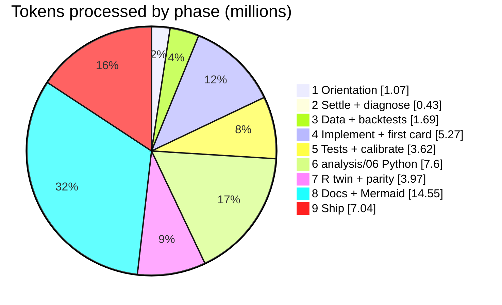

# How the NHL rebuild was done: session log, 2026-09-30

Written from this session's own Claude Code transcript (`~/.claude/projects/C--Users-wbp31-cfb-2026/157b7c09-….jsonl`).
It records every model call with its exact token usage, and every tool call with a timestamp. All times are
Central. Nothing below is estimated unless it says so.

## TL;DR

- **One session, one model, no helpers.** It ran on Claude Opus 5.5 at max effort, with no subagents: one
  conversation did everything.
- **58 minutes** from your prompt (16:13) to the verified release (17:11). The first lock + five reached you at
  about **16:38, 1 hour 52 minutes before the first puck** (18:30).
- **138 model calls and 178 tool calls:** 115 Bash, 35 Edit, 20 Write, 8 Read.
- **45.3 million tokens processed.** 98.9% of that was the conversation re-read from the prompt cache on each call.
  The *new* work was 478K tokens written to the cache and 292K tokens generated, 139K of them thinking.
- **The conversation peaked at 508K tokens**, and it never had to be summarized.
- **Shipped:**
  - 3 commits (13 files, +1,839 / −539 lines), with CI green on Python 3.12, 3.13 and R;
  - 2 GitHub releases, the board and the rules;
  - 89 tests, up from 85;
  - Python and R analysis twins that agree to 5×10⁻¹⁵.
- **You saw ~10% of your plan's limit used.** See [About the 10%](#about-the-10) for what I can and
  can't say about that number.

## What you asked for

1. **16:13:20**: *"alright let's audit this codebase and improve accuracy on nhl picks specifically. need 1 solid
   one and 5 good ones. rewrite the analysis if you have to. run monte carlo sims. our lock last night didn't hit
   lmfaooooooo but hey man that's gambling"*
2. **16:25:54**, mid-task: *"when complete, update all the mermaid charts and other md docs and cut a full release
   please sir"*
3. **17:10:58**, mid-task: *"dont forget to cut the release board as in the orignal prompt sir"*
4. **17:30:14**: this document.

## The run at a glance

```mermaid
gantt
    title NHL rebuild, 2026-09-30 (Central)
    dateFormat HH:mm:ss
    axisFormat %H:%M
    section Diagnose
    1 Orientation (read tool, analysis, tests, DB)        :p1, 16:13:24, 16:15:43
    2 Settle opening night, find the pattern               :p2, 16:15:53, 16:18:24
    3 Backfill 3 seasons, grade 282 lines, 3 backtests      :p3, 16:18:34, 16:31:48
    section Build
    4 New recipe + blend in nhl_edge.py, first card         :p4, 16:31:59, 16:37:25
    Card to you                                            :milestone, m1, 16:37:57, 16:37:57
    5 Tests 85 to 89, migration, --calibrate rewrite        :p5, 16:37:57, 16:43:39
    6 analysis/06 Python, home ratio, card re-issued        :p6, 16:44:35, 16:53:32
    7 analysis/06 R twin, Py == R, local CI                 :p7, 16:53:40, 16:58:41
    section Ship
    8 README + Mermaid, guide, CLAUDE.md, CHANGELOG         :p8, 16:58:55, 17:08:19
    9 Commits, push, CI, releases                           :p9, 17:08:38, 17:11:39
    First puck (PIT @ PHI, NYI @ TOR)                       :milestone, m2, 18:30:00, 18:30:00
```



## Token accounting

### Totals for the job (16:13 → 17:11)

| | tokens | what it is |
|---|---:|---|
| Cache reads | **44,483,053** | the conversation so far, re-sent on every call and served from the prompt cache |
| Cache writes | **478,128** | new material added to the conversation (tool results, file contents, my messages) |
| Output | **292,429** | everything I generated: code, docs, commands, messages |
| └ of which thinking | 139,262 | reasoning before acting (48% of output) |
| Uncached input | **276** | the few tokens after the last cache breakpoint on each call |
| **Total processed** | **45,253,886** | cache reads are **98.9%** of all input |
| Peak conversation size | 508,445 | the context on the last call (started around 47K with the system prompt) |
| Model calls | 138 | all `claude-opus-5-5`; no subagent sidechains |
| Tool calls | 178 | Bash 115 · Edit 35 · Write 20 · Read 8 (parallel calls share one model call) |

Averaged out, each of the 138 calls re-read about 322K tokens of conversation. That average is why the
total is 45 million, even though the conversation itself only ever reached about half a million.

### By phase

| phase | time | calls | tools | processed | share | avg context / call | output (thinking) |
|---|---|---:|---:|---:|---:|---:|---:|
| 1 Orientation | 16:13–16:15 (2m 19s) | 11 | 14 | 1,074,587 | 2.4% | 96,563 | 12,391 (9,853) |
| 2 Settle + diagnose | 16:15–16:18 (2m 31s) | 3 | 3 | 428,605 | 0.9% | 138,088 | 14,341 (12,522) |
| 3 Data + backtests | 16:18–16:31 (13m 14s) | 10 | 14 | 1,691,722 | 3.7% | 164,689 | 44,835 (26,463) |
| 4 Implement + first card | 16:31–16:37 (5m 26s) | 23 | 35 | 5,271,725 | 11.6% | 227,801 | 32,303 (11,571) |
| 5 Tests + `--calibrate` | 16:37–16:43 (5m 42s) | 13 | 17 | 3,624,490 | 8.0% | 275,901 | 37,775 (18,993) |
| 6 analysis/06 Python | 16:44–16:53 (8m 57s) | 22 | 24 | 7,600,280 | 16.8% | 342,749 | 59,812 (32,718) |
| 7 R twin + parity | 16:53–16:58 (5m 01s) | 10 | 13 | 3,973,141 | 8.8% | 394,323 | 29,908 (6,516) |
| 8 Docs + Mermaid | 16:58–17:08 (9m 24s) | 32 | 42 | 14,549,903 | 32.2% | 453,135 | 49,576 (15,412) |
| 9 Ship | 17:08–17:11 (3m 01s) | 14 | 16 | 7,039,433 | 15.6% | 501,996 | 11,488 (5,214) |
| **Job total** | **58m 15s** | **138** | **178** | **45,253,886** | 100% | 325,808 | 292,429 (139,262) |



**The science was cheap; the paperwork was not.** Phase 3 found the real problem and proved the fix. It covered
the three-season backfill, grading every opening-night line against the market, and all three backtests, yet
it used **3.7%** of the tokens. The docs and shipping at the end used **48%**. That isn't because they were
harder. By then every call re-read 450–500K tokens of conversation, while phase 3's calls re-read about 165K.
In a long session, the late phases pay rent on everything that came before.

### How to read these numbers

- **Cache reads** are not new work. Each model call sends the whole conversation back to the model, and the
  prompt cache serves the part it has already seen. 98.9% of input tokens came from the cache.
- **Cache writes** are what was new to the conversation on each call: a tool result, a file I read, the
  message I'd just written.
- **Output** is everything I generated, thinking included. At max effort, about half of it (48%) was
  thinking before acting.
- **The counter I could see.** Claude Code also showed me a running budget: 15,000,000 at the start, and
  14,492,875 when the releases were verified. That 507K is the size the conversation grew to, and it matches
  the transcript's peak context of 508,445. It showed 15,000,000 again when you sent this request, so it's a
  per-request working budget, not your plan meter.

### About the 10%

That number comes from your plan's usage meter. I can't see that meter from inside a session, so the 10%
is your reading, not something I measured. I also don't know exactly how your plan weighs cache reads
against fresh input and output, so I won't convert 45.3M tokens into a percentage of anything.

What the transcript can say is that most of the 45.3M were cache reads, which on the API cost a small fraction
of fresh input. The genuinely new tokens were about 770K: 478K written to the cache and 292K generated. Whatever
formula your meter uses, the work was mostly re-reading a cached conversation, not generating.

### What kept it lean

- **The data never went through the model.** The backfill (102,901 game rows), the three backtests, and the
  analysis loop ran as scripts. I read their summaries, usually a few dozen lines, never the rows.
- **Targeted reads.** There were only 8 whole-file `Read` calls. Most looks at code and docs were
  `sed -n` / `grep` windows onto the exact lines needed.
- **Background jobs.** The history backfill (2,160 player-seasons), the `--build` rebuild (2,053) and the CI
  watch ran while work continued.
- **Parallel tool calls.** 178 tool calls fit into 138 model calls.
- **No subagents,** so nothing was read twice in separate contexts.
- **Reuse.** The Mermaid checker (mermaid 11.17 + jsdom) from an earlier session was run in place rather
  than reinstalled.
- **No summarization.** The conversation stayed under its limit the whole time, so nothing had to be
  re-derived after a summary.

## How it was done, step by step

### 1. Orientation (16:13–16:15)

- **Read the code.** Read `nhl_edge.py` (1,225 lines) in two reads, last night's report,
  `analysis/06_nhl` in both runtimes, the loader, the tests, CI, requirements and the lint config.
- **Checked `nhl.db` with SQL:**
  - only one season of game logs (2025-26, 47,096 rows);
  - no blocked shots anywhere;
  - 187 unsettled paper bets and 577 prop rows from opening night.
- **The first red flag was in last night's report:** 47+ "STRONG PROP" rows, almost all overs, at +18–29%.
  When a model disagrees with the market by that much, in the same direction, dozens of times, the model
  is usually the one that's wrong.
- **The second:** `--calibrate` tested a *different* recipe than the live one (shrink toward the league average,
  no prior season). The live model had never been tested the way it actually runs.
- **Backed up `nhl.db`** to the scratchpad before touching anything.

### 2. Settle opening night and find the pattern (16:15–16:18)

- **`--settle`:** 187 props, $347 staked, −$117.33.
- **The lock + five went 3 of 6.** Suzuki o0.5 PTS, Lindholm u0.5 A and Pastrnak o0.5 PTS lost; Walman u0.5 A,
  McDavid o0.5 A (2 assists) and Eichel o0.5 PTS (3 points) won.
- **Overs were the problem, not the lock.** Value-board overs cashed 33.7% against a model average of 54.3%;
  agree-board overs cashed 43.6% against 62.5%.
- **Last night's scores:** 3 of 5 games were low-event (FLA 1–0 CAR on 35 total shots, NYR 0–3 BOS,
  MTL 3–2 TOR), which sinks overs together.
- **Tonight's slate:** PIT @ PHI and NYI @ TOR at 6:30, LAK @ COL at 9:00. It was 16:18, so the plan became:
  fix what's measurably wrong, get the card out before 6:30, then do the full engineering.

### 3. Get the right data, then test recipes (16:18–16:31)

**History without survivorship.** The stats API's season lists (`skater|goalie/summary`) name everyone who
played:
- 920 and 940 skaters, and 103 and 98 goalies, in 2024-25 and 2025-26 (and every 2023-24 player too).

A 12-thread scratch backfill pulled 2,160 player-seasons (102,901 rows) in about 70 seconds. Using only current
rosters would have tested the model on survivors.

**Every opening-night line graded, not just our picks** (while the backfill ran):
- 282 lines: market log-loss **0.6476**, model **0.6667**.
- Mean P(over): model 0.446, market 0.428, observed 0.355.
- On points, the model ran 3 points above the market.
- A logit blend of the old model with the market was best at 0% model.

**Backtest 1** (2.5 min). The live recipe went against two empirical-Bayes variants, each fit by Nelder–Mead on
2024-25 and tested on 2025-26:
- **The winner** was a per-minute rate regressed toward the position mean × projected ice time.
- **It won most early in the season.** Over the first ten games, goals went 0.4124 → 0.3879 and assists
  0.5583 → 0.5372.
- **Regression needed per stat:** goals ≈ 880 ghost minutes (shooting luck), shots ≈ 77 (shots repeat).
- **Two seasons back** got a weight of about 0, so one prior season was enough.

**Backtest 2** (2 min) added an opponent exponent β and a home factor h. Its numbers weren't comparable to
backtest 1: each run's "eligible players" filter depended on its own minutes projection, so the two runs
scored different player sets.

**Backtest 3** (1.5 min) fixed that. It used a model-independent test set: regulars with ≥ 20 games at
≥ 12 minutes the season before, 36,401 skater-games. The new recipe beat the live one at every line of every
stat; two ice-time variants tied, so the simpler one won.

### 4. Build it into the tool and get tonight's card out (16:31–16:38)

Twenty edits to `nhl_edge.py`, plus one scripted patch:

- **The recipe:** `SKATER_MODEL`, `TOI_*`, `position_means`, and the skater branch of `player_rates`.
- **`opponent_factors`:** the β damping and a symmetric home split. The old one applied the bump to home
  games only.
- **`--build`:** a history season and `fetch_league_players`. Finished seasons are fetched once, and
  players off every roster lose their team, so they can't match a line.
- **A pre-existing bug, fixed:** the build's `INSERT OR REPLACE` wiped the blocked shots that `--settle`
  wrote, so blocks could never get a projection. It's an upsert that keeps them now.
- **The blend:** `blend_p`, a logit blend with the market carrying 75% (`BLEND_MODEL_W` = 0.25, a prior, not a
  fit). Agree picks rank on it and show their EV at it, and `simulate_card` gained a third source,
  "blend".
- **Rebuilt `nhl.db` in the background:** 2,053 player-seasons, 53,073 rows, including last night's games.

The checks that came out of it:
- **Suzuki**, 1.23 pts/game last season, now projects to 1.11 at a neutral rink: 67% to get a point against
  the market's 65%. The old model had said 76%.
- **Opening night re-projected** with the new recipe (no 2026-27 data): log-loss **0.6427 vs the market's
  0.6437** (old recipe 0.6622), with the over bias gone.
- **Tonight's lines:** pulled once from The Odds API and saved to CSV, so rendering could be checked without
  spending credits twice. Of 346 prop sides, **none was +EV at the blend**.
- **First official snapshot and report** (196 prop rows, 125 paper plays).
- **Byfield's history checked:** 0.38 → 0.32 assists per game over the last two seasons, and away at a stingy
  Colorado. Then the card went to you.

### 5. Tests and an honest `--calibrate` (16:38–16:44)

- **Tests went from 85 to 89.** Three failed as expected, because they encoded the old recipe. I rewrote
  them and added new ones for the position means, the recipe computed by hand, blocks from settle, the upsert,
  history players never matching, and the blend.
- **Two of my new test expectations were wrong**, not the code. The logit midpoint of 0.6 and 0.8 is 0.710,
  not below 0.70, and 36/31 doesn't reach the 1.20 clamp.
- **The recipe was refactored onto sufficient statistics** (`skater_projection`), so the backtest runs on
  running sums instead of O(n²).
- **`MODEL_VERSION`** is now stamped on every `props` / `paper_bets` row, through a migration. Tonight's rows,
  written minutes before the column existed, were tagged by a one-off update.
- **`--calibrate` was rewritten** on `backtest()`, which calls the live `skater_projection`, `goalie_rate` and
  `opponent_factors`. It runs in 3.3 seconds and reproduced the scratch backtest.

### 6. Rewrite `analysis/06` in Python (16:44–16:53)

- **Checked the data first:** all 1,312 games per season have both teams, and every player has a position.
- **Wrote the loaders and the loop.** New loaders are `load_logs(seasons)` and `load_market_lines()`. The loop
  is fully vectorized:
  - **A** ROI by kind and recipe;
  - **B** slices;
  - **C** the backtest (live vs old vs naive, bins, dispersion grid, ablation);
  - **D** teammate correlation;
  - **E** model vs market on every settled line, with the blend curve.
- **C matched `--calibrate`** at every printed digit.
- **The ablation caught something.** The fitted home factor (h ≈ 1.13) was worth nothing out of sample. The
  league's home/away scoring ratio was **1.11 in 2024-25 but 1.045 in 2025-26**, so one season's fit
  overshot. h is now that ratio pooled over both seasons (1.037 shots, 1.078 points).
- **`TEAM_RHO` was re-measured** on the whole league (802,876 teammate pairs): 0.1047 / 0.0525.
- **The card was re-derived** on the final constants. Drysdale replaced Horvat, and a re-score of opening
  night's edge bands under the new recipe gave no reason to touch the value tiers.
- **Added the miss-rate line** under the lock, and re-issued the official snapshot at **16:52**. Necas became
  under 1.5 points: between the 16:37 and 16:52 pulls, DraftKings moved his points line from 0.5 to 1.5.

### 7. The R twin and parity (16:53–16:59)

- **Wrote `load_nhl.R` and `nhl_loop.R`** with the same SQL, bins and recipe as Python.
- **Compared every numeric cell** across 7 CSVs and 217 rows, by key: **max |Δ| 4.9×10⁻¹⁵**, no missing rows,
  no NaN mismatches.
- **Made the printed tables byte-identical** after three cosmetic fixes: R pads multibyte characters by bytes,
  and prints NaN where Python prints nan.
- **Ran the full CI sequence locally** against empty DBs: compile, ruff, 89 tests, `--help` ×4, schema
  bootstrap, and all 12 analysis scripts.
- **Checked a one-season DB too:** C and E explain what to run instead of crashing.

### 8. Docs, diagrams, changelog (16:59–17:08)

- **Mapped every stale reference** with grep: the old recipe, the old counts, the old constants.
- **Computed the README's worked example from the live functions,** using tonight's lock instead of a
  hypothetical. Byfield: 19.64 projected minutes × 0.01691 assists/min = λ 0.332. Colorado's defense and the
  road take it to 0.272. That gives P(0) = 76.2% against the market's 66.5%, a blend of 69.1%, and EV −2.6%.
- **Rewrote the README's NHL section:**
  - the prose;
  - all six NHL Mermaid charts;
  - the backtest table, the market check, and the refit simulations;
  - the ER diagram, with the new `model` columns;
  - the honest status.
- **Updated the rest of the README:** the top-level architecture and analysis diagrams, the quick start,
  the Files table and the Roadmap.
- **Updated the other docs:** `analysis/README.md`, `betting_guide.md` §6, `CLAUDE.md` (including a new gotcha,
  below) and a full `CHANGELOG.md` entry.
- **Named the new pieces in `LICENSE`.** Terms unchanged, in its own commit.
- **Caught one wrong claim in my own draft before it shipped.** It said that after ten games the rate is
  "about a third this season"; the real numbers are about 14% for the assist rate and about 80% for minutes.
- **Mermaid:** 28 of 28 blocks parse.
- **Line endings:** normalized CRLF to LF, since Python on Windows had written CRLF.
- **Project memory updated** for future sessions.

### 9. Ship (17:08–17:11)

- **Three commits:**

  | commit | what | files |
  |---|---|---|
  | `2b5ea9b` | code, analysis and docs | 11 files, +1,644 / −535 |
  | `b747149` | the report | +190 |
  | `9a0511d` | the license naming | +5 / −4 |
- **Pushed to `main`.** CI run 36783898226 was green on Python 3.12, Python 3.13 and the R twins.
- **Two releases**, each with the full text as the body:
  - [`nhl-wednesday-2026-09-30`](https://github.com/wbp318/cfb_soccer_nhl_2026_2027/releases/tag/nhl-wednesday-2026-09-30):
    the board, the three-way Monte Carlo, the ranked props;
  - [`rules-2026-09-30`](https://github.com/wbp318/cfb_soccer_nhl_2026_2027/releases/tag/rules-2026-09-30):
    the changelog entry with all the evidence, marked Latest.
- **Checked the published release** to confirm it shows the board.

## Mistakes along the way, and how each was caught

| what | caught by | fix |
|---|---|---|
| The Bash tool's heredocs collapse `\\` to `\`, so a scripted patch wrote a real newline into an f-string | ruff, immediately | put patch scripts in files (Write) with raw strings; added to `CLAUDE.md` gotchas |
| The same issue made three more scripted doc patches miss their target text | each script's own `assert` (nothing wrong was written) | same |
| Two of my new test expectations were wrong | pytest | fixed the tests, not the code |
| Backtest 2 compared different player sets | reading its sample sizes (39,591 vs 40,885) | backtest 3 on a fixed, model-independent set |
| The first report (16:37) used pre-final home/correlation constants | the ablation in `analysis/06` C | re-issued the report at 16:52, before puck drop; both snapshots are in the ledger |
| A sentence in my README draft overstated how fast the rate adapts | recomputing it before commit | corrected to 14% / 80% |
| An ambiguous SQL column in a data check | SQLite error | qualified the column names |
| A `sleep` to wait for the backfill | the harness blocked it | waited on the job's own completion instead |
| This write-up: a timezone-aware vs naive comparison in the usage script | Python error | stripped the tz |
| The CHANGELOG entry and the `rules-2026-09-30` release said the first report was generated at 16:40 | checking the DB for this write-up: the first snapshot is stamped 16:37:17 | fixed with this document's commit: both CHANGELOG mentions say 16:37, and the release body was re-published |
| My mid-task message said the card went out 52 minutes before puck | recomputing it here | it was 1 hour 52 minutes |
| My mid-task message said DraftKings added a 1.5-point line for Necas | the `props` table | DraftKings *moved* his line from 0.5 to 1.5; the 0.5 was gone by 16:52 |

## Scratch scripts (in the session scratchpad, not the repo)

`backfill_hist.py` (three seasons, no survivorship) · `grade_all_props.py` (every opening-night line vs market) ·
`backtest.py`, `backtest2.py`, `bt3.py` (the three backtests) · `opening_night_new.py` (re-projection with the new
recipe) · `new_calibrate.py` (spliced into the tool) · `cmp_csv.py` (Python vs R, cell by cell) ·
`readme_*.py`, `claude_md.py`, `analysis_readme.py`, `license_toggle.py` (doc patches) · `timeline.py`,
`usage.py` (this document's numbers). The scratchpad is temporary; everything that matters is in the commits.

## Re-running the token count yourself

Each API response is logged once per content block, all sharing one `message.id`, so dedupe on that and keep
the entry with the final (largest) `output_tokens`:

```python
import json
from collections import Counter

path = r"C:\Users\wbp31\.claude\projects\C--Users-wbp31-cfb-2026\157b7c09-13b7-4854-ac41-4ba8787c8bdd.jsonl"
calls = {}
for line in open(path, encoding="utf-8"):
    d = json.loads(line)
    if d.get("type") != "assistant":
        continue
    m = d["message"]
    u = m.get("usage") or {}
    if m["id"] not in calls or u.get("output_tokens", 0) > calls[m["id"]].get("output_tokens", 0):
        calls[m["id"]] = u
tot = Counter()
for u in calls.values():
    for k in ("input_tokens", "cache_creation_input_tokens", "cache_read_input_tokens", "output_tokens"):
        tot[k] += u.get(k) or 0
print(len(calls), "calls", dict(tot), "processed", sum(tot.values()))
```

Run it later and it will include this write-up's own calls as well. When the numbers above were taken, this
document had used 9 calls and about 4.9M tokens processed, almost all cache reads of the 550K-token
conversation.
